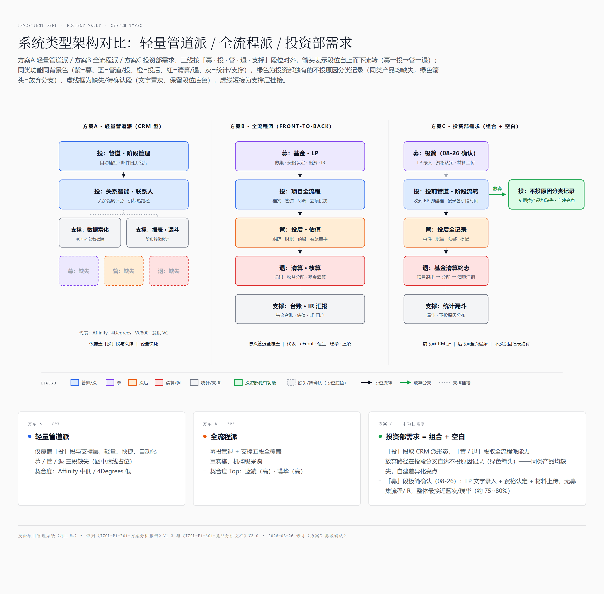
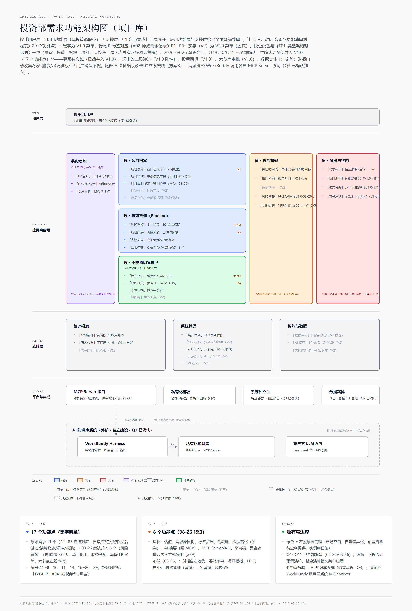

# P1-R01-方案分析报告（V1.3）

## 一、方案总览

### 1.1 架构图（类型对比 · 功能架构）



> 图 1：「方案A 轻量管道派 / 方案B 全流程派 / 方案C 投资部需求」三线并列，统一按「募/投/管/退 + 支撑」分段命名；箭头表示段位自上而下流转（募→投→管→退），绿色箭头为放弃分支（投段 → 不投原因记录），虚线短接为支撑层挂接；相同功能同色（募紫、管道蓝、投后橙、清算红、支撑灰），不投原因分类记录为投资部独有（绿色高亮），虚线框为该段缺失/待确认（文字置灰、保留段位底色）；高清原文件 [`P1-R01-F01-类型架构对比图.html`](./P1-R01/P1-R01-F01-类型架构对比图.html)（浏览器打开可缩放查看）。



> 图 2（结论性核心内容）：按「用户层 → 应用功能层（募投管退段位）→ 支撑层 → 平台与集成」四层细化的**功能架构与全量系统菜单**（对应附件4 的 29 个功能点，「」标注）——**黑字为 V1.0 菜单，行尾 R 标签对应《P1-R01-A02-原始需求记录》R1~R6；灰字（V2）为 V2.0 菜单（置灰）**；段位配色与图 1 一致，绿色为投资部独有的不投原因管理；原待确认项（Q7/Q10/Q11）已于 08-26 全部确认，图内标注随附件6 修订版更新。底部虚线边界为外部 AI 知识库系统（独立建设 · Q3，按其方案B 展开），两系统经 WorkBuddy 调用各自 MCP Server 实现接口级协同（见第六节）；高清原文件 [`P1-R01-F02-功能架构图.html`](./P1-R01/P1-R01-F02-功能架构图.html)（浏览器打开可缩放查看）。

### 1.2 方案速览

| 方案 | 构成 | 功能覆盖 | 上线 | 灵活度 | 成本模式 | 详细 |
|---|---|---|---|---|---|---|
| A | 轻量管道派（CRM 型）产品形态 | 仅「投」段 + 支撑；募/管/退缺失 | 快（开通即用） | 低 | —（不采购，仅架构参照） | 见 2.1 |
| B | 全流程派（Front-to-Back）系统形态 | 募投管退 + 支撑全覆盖；不投原因结构化需定制 | 中（项目制实施） | 低~中 | —（不采购，仅架构参照） | 见 2.2 |
| C | 按投资部需求组合自建（V2.0 深化扩展） | 按需定义，不投原因结构化原生存续 | 慢（分期建设，V1.0 先跑通 17 功能点） | 高 | 自建人天（待评估） | 见 2.3 |

> 经 Q2 确认：**不走第三方采购**——方案A/B 仅作功能架构参照（设计对标用），建设路线确定为**方案C（自建）**；成本只计自建人天（待开发团队评估），无需 RFP 询价。功能覆盖为基于附件1 功能核查的客观对照。

### 1.3 各方案下一步行动

**方案A · 轻量管道派（架构参照）**

1. 不做厂商接触与采购动作（Q2 已确认不走采购）；
2. 提炼其字段设计、漏斗视图、关系自动化捕捉等设计要点，供自建前段借鉴（见附件1 设计启示）。

**方案B · 全流程派（架构参照）**

1. 不做厂商接触与采购动作（Q2 已确认不走采购）；
2. 提炼其投后管理、基金清算/业绩核算等后段模块设计要点（蓝凌、璞华易投、恒生为契合度 Top3），供自建后段借鉴。

**方案C · 投资部需求组合（建设路线）**

1. Q5 已确认：不投原因采用「预置分类选项 + 自定义补充」，各节点原因实例已于 08-26 给出（附件2 5.2），预置分类清单待业务整理后落入数据模型；
2. Q7 已确认（08-26）：境内外 20+ 只基金、将持续新设，**单基金单项目为基准架构**（预留 1:N），数据模型可定稿；
3. 按《P1-R01-A04-功能清单对照表》V1.0 的 17 个功能点排期（08-26 确认项已全部并入），输出页面原型（待办：嘉怡与胡博对接细化功能菜单/字段定义/原型）；
4. 独立系统建设（Q3 已确认），按私有化部署（Q2 已确认）输出技术方案与自建人天估算；
5. Q10/Q11 已确认（08-26）：**内置六节点在线审批**（可独立运行或嵌入简道云 OA「投资产业」板块）、**募段极简纳入**（LP 管理 + 资格认定）——V2.0 范围已按此修订（见 4.3 与附件4）。

### 1.4 核心事实

| 要点 | 内容 |
|---|---|
| 建设方式 | **自建（方案C 路线），私有化部署，与 AI 知识库系统独立**；方案A/B 竞品仅作功能架构参照（Q2/Q3/Q9 已确认） |
| 方案区分维度 | 系统类型 × 覆盖范围：轻量管道派（仅投段）/ 全流程派（募投管退全覆盖）/ 需求组合（投段取 CRM 形态 + 管退取全流程能力 + 独有空白点） |
| 无单一产品覆盖 | 前半段（BP 建档 + 管道 + 时间戳）是 CRM 派标配，后半段（投后到基金清算）只有全流程派覆盖（附件1 执行摘要） |
| 独有空白 | 不投原因分类记录（Pass Reason）为全市场空白（10 家全量档案核查）——方案C 的核心差异化 |
| 契合度基准 | 功能契合度 Top3（架构参照优先级）：蓝凌（高·全场最高）＞ 璞华易投（高）＞ VC800（中高）（附件1 第三章） |
| 成本事实 | 成本仅计自建人天（待开发评估）；不走第三方采购，无需 RFP 询价（Q2 已确认） |

### 1.5 报告信息

| 项 | 内容 |
|---|---|
| 报告日期 | 2026-08-26（V1.3：Q7/Q10/Q11 经 08-26 投资部需求沟通会确认回填，**Q1~Q11 全部答复完毕**——阶段管道十→十二阶段（3.2 重绘，放弃节点 6→7）；Q7 基金维度定稿（20+ 基金、单基金单项目基准、预留 1:N）；Q10 对接边界定稿（不强制打通 + 内置六节点在线审批 + 嵌入简道云 OA）；Q11 募段极简纳入（LP 文字录入 + 资质材料 + 资格认定）；投后四项刚性功能与 V2 取舍（不做：财报自动收集/委派董事/尽调模板/LP 门户）；退出三段递进；材料逻辑包归档；**08-26 确认项全部并入 V1.0（11→17 功能点，V2.0 余 8 个）**；4.1 扩为九模块、4.3 重写、第八节回填、风险与下一步更新、附件3/4/5/6 同步修订；V1.2：Q1~Q6/Q8/Q9 经业务确认回填——私有化部署且不走第三方采购（方案A/B 转为功能架构参照，成本仅计自建人天）、与 AI 知识库系统独立、档案字段与投后范围按行业标准数据建模、不投原因「预置选项 + 自定义」、提醒功能确认需要、现状为表格管理；Q7/Q10/Q11 待确认；新增《P1-R01-F02-功能架构图》并嵌入 4.1，后按讨论结论加入 AI 知识库外部系统块与 MCP 协同（第六节协同机制同步改写，项目库侧新增 MCP Server 接口入 V2.0），应用功能层与支撑层扩为全量菜单（对应附件4 29 功能点）：V2.0 置灰、V1.0 标注对应原始需求 R1~R6；全项目统一术语口径：投前管道（①~⑦）→ 投资执行（⑧）→ 投后与退出（⑨~⑩），弃用"十段业务管道"（3.2 增术语分层说明）；功能架构图上移至 1.1 图 2（结论性核心内容前置），4.1 改为指引；审查修订：第六节补协同机制来源与生效前提、附录补收附件6、2.3 投后/基金段归因修正（Q6/Q7）、4.1 图注与 Q11 答复列修正、附件1 结论口径同步 V3.1；V1.1：参照知识库项目报告体例重写——方案A/B/C 与附件5 三泳道对齐，新增方案速览/各方案下一步行动/核心事实/风险清单/需求覆盖对照，图片路径改为工作区根目录相对；V1.0：总分结构全量更新、更名《P1-R01-方案分析报告》；更早略） |
| 报告状态 | **V1.3（Q1~Q11 全部答复完毕）**——下一迭代触发点：原型细化与技术方案（残留待定项见 4.3 与风险 R1） |
| 项目名称 | 投资项目管理系统（业务称呼：项目库） |
| 需求基线 | 见《P1-R01-A02-原始需求记录》（原文逐字收录 + 拆解 R1~R6） |
| 竞品分析 | 见《P1-R01-A01-竞品分析》（V3.2：10 家全量档案 + 市场全景 + 双功能矩阵 + 设计启示；结论口径已按 Q2"不走采购"更新） |
| 术语表 | 见《P1-R02-术语表》（本项目投资业务与部署术语；知识库项目 AI/架构术语见项目 01《P1-R02-术语表》） |
| 功能清单 | 见《P1-R01-A04-功能清单对照表》（行业全量 29 功能点 × V1.0/V2.0 范围逐条对照） |
| 架构对比图 | 见《P1-R01-F01-类型架构对比图》（三线并列，含段位流转/放弃分支/支撑挂接箭头语义） |
| 功能架构图 | 见《P1-R01-F02-功能架构图》（投资部需求四层细化：用户/应用功能/支撑/平台与集成，标注 V1.0/V2.0 与待确认项） |
| 阶段流转与流程 | 见《P2-R01-D01-项目阶段流转与操作流程图》（功能调研阶段文档，挂靠《P2-R01-产品需求文档》；十二阶段流转全图、7 放弃分支、投前双路径、投后四项、退出三段、六节点审批） |
| 数据建模 | 见《P2-R01-D02-数据建模》（功能调研阶段文档；ER 总图 + 15 实体字段表 + 1:1 基准关联设计 + V2 扩展预留） |
| 菜单与字段 | 见《P2-R01-D03-功能菜单与字段清单》（功能调研阶段文档；V1.0 全量菜单树 + 21 页面清单 + 页面-实体映射，嘉怡×胡博对接材料） |
| **阶段2 主文档** | 见《P2-R01-产品需求文档》（V1.0）——功能调研阶段主输出物，整合 P2-R01-D01~P2-R01-D03 |
| 关联项目 | AI 知识库（`项目 01《P1-R01-方案分析报告》（5-【ACTIVE】AI知识库）`） |

> 方案A/B/C 命名与《P1-R01-F01-类型架构对比图》三条泳道一一对应；报告为总分结构——第一节可单独阅读，第二~九节为分述，支撑细节全部下沉至附件 P1-R01-A01/P1-R01-A02/P1-R01-A04、图 P1-R01-F01/P1-R01-F02。

## 二、三方案详述

### 2.1 方案A：轻量管道派（CRM 型）

以 Deal Flow 管道与关系管理为中心的轻量产品（对应附件5 左泳道），**定位为功能架构参照，不作采购（Q2 已确认）**。

- **形态与覆盖**：仅「投」段 + 支撑层（数据富化 / 报表漏斗）；募 / 管 / 退三段缺失（图中三个虚线小块，保留段位底色）；
- **代表产品**：国际 Affinity、4Degrees、DealCloud（多租户 SaaS）；国内 VC800/PEPM、慧投 VC（SaaS + 私有云）；
- **部署**：SaaS 为主（Q2 已确认私有化部署，本类仅作架构参照）；
- **成本模式**：按席位订阅——不适用（不走采购）；
- **优势**：上线最快、使用轻量、自动化程度高（邮件/日历/名片自动捕捉）；
- **劣势**：**不覆盖"投后全记录至清算注销"的核心需求**（已投闭环整体缺失）；不投原因仅有自由文本字段，无结构化分类与统计；
- **参照价值**：字段设计、漏斗视图、自动化捕捉等前段设计要点，供自建借鉴（附件1 设计启示）。

### 2.2 方案B：全流程派（Front-to-Back）

募投管退 + 支撑五段全覆盖的机构级系统（对应附件5 中泳道），以国内私有化供给为主，**定位为功能架构参照，不作采购（Q2 已确认）**。

- **形态与覆盖**：五段全覆盖，含基金台账 / 估值 / LP 门户；蓝凌明示"基金清算分配、基金业绩核算"专模块，与需求终态直接对口；
- **代表产品**：国内私有化——蓝凌 VCPE、璞华易投、恒生电子（契合度 Top3）；国际——eFront（Aladdin 云为主，落地条件受限）；
- **部署**：本地部署 / 私有化实施（国内）——Q2 已确认私有化，本类仅作架构参照；
- **成本模式**：项目制定价——不适用（不走采购）；
- **优势**：后段能力成熟，直接满足投后闭环与基金维度（Q7 已确认）；
- **劣势**：重实施、周期长；不投原因结构化需定制开发；前段管道体验相对轻量产品偏重；
- **参照价值**：投后管理、基金清算/业绩核算等后段模块设计，供自建后段借鉴（蓝凌、璞华易投、恒生为契合度 Top3）。

### 2.3 方案C：投资部需求组合（自建，建设路线）

按投资部需求组合能力建设（对应附件5 右泳道）：前段（投段管道）取 CRM 派形态，后段（管 / 退）取全流程派能力，不投原因分类记录为独有。**经 Q2 确认，本方案为建设路线。**

- **实施方式**：V1.0 全自建（17 个功能点，08-26 确认项已全部并入，见附件4）；V2.0 继续自建深化（估值、原因树、标签、驾驶舱、数据富化、AI 摘要、MCP/API、移动端），功能设计参照全流程派成熟模块；
- **功能覆盖**：唯一能原生存续"不投原因分类记录"的方案（全市场空白 → 自建差异化亮点）；
- **部署**：私有化部署（Q2 已确认）；与 AI 知识库系统相互独立，不共用底座（Q3 已确认，见第六节）；
- **成本模式**：自建人天（待开发评估），无采购费用（Q2）；
- **优势**：完全贴合原始需求口径；差异化能力沉淀为部门自有资产；
- **劣势**：上线最慢（分期建设）；行业最佳实践（字段 / 报表 / 预警）需自行补齐；长期维护依赖开发资源；
- **适用前提**：Q5 已确认（预置选项 + 自定义补充）；Q7 已确认（08-26：20+ 基金、单基金单项目基准）；开发资源到位。

### 2.4 需求覆盖对照

以附件1 需求契合度分级口径的 6 项功能特征对照三方案：

| 需求特征 | 方案A | 方案B | 方案C |
|---|---|---|---|
| ① BP 即入库 | ✅ | ✅ | ✅ |
| ② 投前管道 + 时间戳 | ✅ | ✅ | ✅ |
| ③ 不投原因结构化 | ❌（自由文本） | ⚠️ 需定制 | ✅ 原生 |
| ④ 投后全记录 | ❌ | ✅ | ✅（V1.0 基础版起步） |
| ⑤ 清算 / 注销终态 | ❌ | ✅ | ✅ |
| ⑥ 私有化 + 中文 | ⚠️ 仅国内轻量产品满足 | ✅（国内私有化） | ✅（随技术方案） |

> ③ 在全市场为空白（附件1 契合度口径注），市场上无现成可用，自建为唯一原生实现路径；④ 对方案C 指 V1.0 即按四项刚性功能完整落地（08-26：事件记录/报告归档/风险预警/到期提醒≥30天，全部并入 V1.0）。

## 三、需求理解与业务规则

### 3.1 需求原文与四大特征

原始需求逐字收录见《P1-R01-A02-原始需求记录》（含拆解 R1~R6 与提出背景）。核心特征：

1. **宽口径入库**：一接触项目即入库——收到 BP 就建档，不做任何前置筛选；
2. **过程留痕**：项目沿投资流程推进时，系统记录每个阶段的时间节点；
3. **未投闭环**：项目在任何阶段放弃，记录「放弃时所处阶段 + 不投原因」后归档；
4. **已投闭环**：投后管理全量记录，直至项目退出、基金清算/注销，系统记录方为终态。

### 3.2 项目十二个阶段：投前管道 → 投资执行与设立 → 投后与退出（08-26 沟通会定稿）

```
① 接触/收 BP ──→ ② 线上路演 ──→ ③ 保密协议签署 ──→ ④ 尽调资料包 / 现场访谈
> ⚠️ 08-27 调整：⑧⑨ 已对调（先 ⑧ 基金设立、后 ⑨ 出资，胡博确认），且新增阶段停滞提醒与 GP/LP 两级放弃原因——见《P2-R01-A01-需求调整记录-20260827》；本节为 08-26 定稿口径，最新阶段链以《P2-R01-产品需求文档》5.1 为准。
──→ ⑤ 立项 ──→ ⑥ 投资人路演（新增）──→ ⑦ 投决 ──→ ⑧ 出资
──→ ⑨ 基金设立（显式入链）──→ ⑩ 投后管理（持续）──→ ⑪ 项目退出 ──→ ⑫ 基金清算注销（终态）
```

会前十阶段口径（"看 BP 初筛""听路演"为独立阶段、退出与清算合并）已于 08-26 修订为上述十二阶段（附件2 5.1）：③ 保密协议签署显式入链；④ 存在两条路径——签保密协议后对方直接发资料包，或先现场访谈、确认跟进后再发资料包；⑥ 投资人路演为新增节点；⑨ 基金设立显式入链；⑪ 项目退出与 ⑫ 基金清算注销拆分为两阶段，退出段为**三段递进**（项目退出 → 收益分配 → 基金清算注销，见 4.1）。

**放弃节点 7 个**（覆盖①②④⑤⑥⑦，③保密协议环节无放弃点；新增"投资人路演后放弃"）：看 BP 后不看 / 线上路演后 / 现场访谈后 / 收到尽调资料后 / 立项时（老板否决）/ 投资人路演后 / 投决时——各节点原因实例见附件2 5.2。放弃后项目进入"未投归档"；过了 ⑧ 出资即无"放弃"，沿 ⑨ 记录至 ⑫ 终态。

> **术语口径（全项目统一）**：十二个阶段按行业通识分三段——**投前管道（①~⑦，Pipeline/Deal Flow）→ 投资执行与设立（⑧~⑨）→ 投后与退出（⑩~⑫，Portfolio/Exit）**。分层用词：对外/文档用「投前管道」「投后管理」；系统菜单用业务动作词——「项目跟进」（投前）、「投后时间线 / 投后文档」等（管段）。投资部口径的区分特征——投前管道 = **宽口径入库（BP 即进）+ 七个放弃节点留痕 + 不投原因结构化**；投后管理 = **全量记录直至基金清算/注销**（而非项目退出）。标准状态标签（10 个）：BP接收 / 路演完成 / 保密协议签署 / 尽调启动 / 立项通过 / 投决通过 / 已出资 / 投后管理 / 已退出 / 已注销，支持按放弃原因快速筛选统计。（**09-01/09-04 起以 P1-R02 术语表为唯一术语源**：本段历史建议名已被 A07/A08/A10 定版替代——UI 显示「接收 BP」「资料包」「末级原因」，菜单定名「项目库 / 投后事项 / LP 出资 / 基础数据」等；本文其余旧称均按术语表映射阅读）

### 3.3 核心业务规则

| # | 规则 | 说明 |
|---|---|---|
| N1 | 最低入库门槛 | 收到 BP 即建项目档案；BP 原件作为首个入库材料 |
| N2 | 阶段流转留时间戳 | 每次阶段推进记录发生时间，形成项目时间线 |
| N3 | 未投项目：节点 + 原因 | 放弃时记录所处阶段（自动带出时间戳）+ 不投原因；归档后可检索、可统计 |
| N4 | 已投项目：投后全记录 | 投后内容范围按行业标准数据建模（Q6 已确认），参照投后监控专项产品（iLevel/Solovis 等）的字段与报表实践 |
| N5 | 终态 = 清算/注销基金 | 生命周期终点锚定在**基金**维度（清算、注销），而非仅项目退出——系统需有基金实体与项目-基金关联（Q7 已确认：20+ 只基金、单基金单项目为基准、预留 1:N） |
| N6 | 退出三段递进 | 项目退出（分批次登记）→ 收益分配（按 LP 约定比例核算）→ 基金清算注销（所投项目全部退出后启动），不可合并或省略（08-26） |
| N7 | 材料逻辑包归档 | 材料按 BP 包 / 路演纪要 / 尽调资料包 / 投决包 / 基金设立文件 / 投后资料**强制分类**，替代通用附件堆砌（治现有 CRM 三大缺陷，08-26） |
| N8 | 到期前置提醒 | 对赌协议到期、回购触发、关键条款履约/资质续期等，前置 **≥30 天**系统提醒（08-26） |

## 四、功能规划与版本规划

### 4.1 功能模块总览（九模块，08-26 沟通会后定稿）

> 功能架构图（四层 × 段位 × 全量菜单，V1.0/V2.0 与 R 标注）**见 1.1 图 2** 及《P1-R01-F02-功能架构图》，属结论性核心内容已前置至第一节。行业通用模块结构为「募投管退四段 + 支撑层」（源自 P1-R01-A01 第 2.5 节竞品模块普查）；本节九模块覆盖"募/投/管/退 + 支撑"（Q11 已确认募段极简纳入，08-26）。

| 模块 | 段位 | 功能要点 |
|---|---|---|
| 项目档案 | 投 | 建档（BP 上传即建）、基础信息（字段按行业标准数据建模——Q4 已确认）、材料库（按逻辑包强制分类：BP 包/路演纪要/尽调资料包/投决包/基金设立文件/投后资料，08-26） |
| 投前管道（Pipeline） | 投 | 十二阶段定义与流转（3.2）、时间戳记录、当前状态视图（10 个标准状态标签） |
| 放弃管理 | 投 | 放弃节点选择（7 节点，所处阶段自动带出）、不投原因（预置分类 + 自定义补充——Q5，实例库见附件2 5.2）、归档与检索 |
| 基金管理 | 投/退 | 基金实体（有限合伙全称/注册资本/成立日期/注册地、LPA 与工商注册文件上传）、出资记录按基金维度手工维护；20+ 只基金、**单基金单项目为基准**（Q7 已确认，预留 1:N）；已投项目独立归档（LP 协议/工商文件/托管协议/证券户凭证等） |
| 募段·LP 管理（极简） | 募 | LP 主体名称/认缴实缴金额/出资时间**文字录入**（一 LP 多主体）、资质材料上传（LPA/主管协议/募集协议）、LP 资格认定（设立基金出资前）；**无**募集流程/报表（Q11 已确认） |
| 投后管理 | 管 | 四项刚性功能（08-26）：① 事件记录（股东会/董事会决议、重大经营变动、访谈纪要，附件 + 时间戳固化）；② 报告归档（季报/年报/专项报告，手动上传）；③ 风险预警（二级市场股价走势、行业舆情定时收集推送，可接企查查/同花顺）；④ 到期提醒（对赌/回购/条款履约/资质续期，前置 ≥30 天） |
| 退出与分配 | 退 | 三段递进（08-26，不可合并省略）：① **项目退出**（原"退出登记"更名；类型表单选择：分红/股权转让/IPO 减持等，分批次登记，字段含卖出价格数量/时间节点/本金/收益/收益率）→ ② **收益分配**（按 LP 约定比例核算、分配明细与时间节点、付款记录）→ ③ **基金清算注销**（所投项目全部退出后启动：清算报告/资产处置/税务清算/剩余资金分配/工商注销） |
| 统计报表 | 支撑 | 阶段漏斗（各阶段转化率/放弃率）、不投原因分布；报表口径先上系统再定（现为半年/年度手工统计，08-26） |
| 权限 | 支撑 | 投资部内部 10 人以内（Q1 已确认）；角色 + 菜单级控制（08-26）；多分支机构权限预留（宏兆背景） |

> 基金清算模块的菜单归属（放「投后管理」还是「基金管理」）待定（附件2 5.5 注）；内置六节点在线审批（立项/投决/基金注册/付款/分配/注销）为横切能力，V1.0 交付（见 4.2 与附件4 #29）。

### 4.2 V1.0（跑通，08-26 确认项全部并入）

**17 个功能点** = 原始需求直接要求的 11 个（附件4 编号 #1~8、10、11、17：项目档案三件套、投前管道流转、放弃节点记录、**不投原因结构化分类（市场空白，核心差异化）**、投后基本记录、基金清算终态标记、基础统计漏斗）**+ 08-26 沟通会确认纳入的 6 个**（#14 风险预警、#16 到期提醒≥30天、#18 项目退出、#19 收益分配、#20 募段 LP 极简、#29 六节点在线审批）。原 11 项同步按会议结论加深：十二阶段管道（#3）、7 放弃节点（#5）、材料逻辑包归档（#7）、基金实体 1:1 基准（#17）。逐条对照见《P1-R01-A04-功能清单对照表》。

> 版本边界口径（08-26 后）：沟通会确认"要做"的内容（含退出三段递进、投后四项刚性功能、六节点审批、极简募段）一律 V1.0 交付；确认"不做"的见 4.3。

### 4.3 V2.0（完善，08-26 沟通会后修订）

08-26 确认项并入 V1.0 后，V2.0 剩 **8 个功能点**（#2 标签扩展、#6 两级原因树、#13 投后估值、#23 驾驶舱、#25 数据富化候选、#26 AI 摘要、#27 MCP Server/API、#28 移动端），另含 #29 简道云 OA 嵌入方式深化：

- **深化方向**：估值管理、两级原因树、标签体系、驾驶舱/组合看板、移动端、**MCP Server 接口（对外协同 · 见第六节）**、AI 摘要（经 MCP）、数据富化（候选）；
- **确认不做**（08-26）：财报自动收集（手动上传即可）、委派董事管理、尽调模板（尽调以向公司索取资料包 + 现场访谈为主）、LP 门户/IR 汇报（无募集流程/报表）、机构管理模块（暂缓，无实际使用需求）；
- **系统边界**（Q10 已确认）：不与财务/OA/外部监管系统强制打通，仅内部项目台账；外部联动经 WorkBuddy（MCP）调用项目库与企查查/同花顺等。

## 五、市场品类与竞品对标

### 5.1 品类命名

本系统在市场上的正式品类为**股权投资管理系统**（PE/VC Investment Management System），亦称**投资机构业务管理系统**、**基金投资全生命周期管理系统**。需求表述与行业术语的对应：

| 原始需求表述 | 行业术语 |
|---|---|
| 收到 BP 就丢进去 | Deal Flow / 项目管道管理（Pipeline Management），宽口径入库 |
| 记录放弃的时间节点 | 阶段管理 + 漏斗转化（Funnel） |
| 记录不投的原因 | Pass Reason（不投/淘汰原因分类） |
| 投后全部内容记录 | 投后管理（Portfolio Monitoring） |
| 直至清算、注销基金 | 基金生命周期 + 退出管理（Fund Lifecycle / Exit） |

需求虽为口语化表述，但恰好构成该品类的标准形态（宽口径入库 + 阶段留痕 + 不投原因结构化 + 投后闭环），自建时可按品类最佳实践补齐字段（如项目来源渠道、赛道标签、接触人数、下次跟进提醒等）。

### 5.2 竞品/对标产品清单

| 阵营 | 代表产品 | 特点 | 对本项目的参考价值 |
|---|---|---|---|
| VC/PE CRM（轻量、管道为核心） | Affinity、DealCloud（Intapp 旗下）、4Degrees | 「项目库」标准形态：关系智能 + Deal Flow，SaaS 为主 | 字段设计、漏斗视图、不投原因分类树 |
| 机构级 Front-to-Back（重、全流程） | eFront（BlackRock 旗下）、Dynamo、Allvue | 募投管退全链路：基金台账、估值、LP 汇报 | 基金维度建模（Q7）、投后模块深度 |
| 投后监控专项 | iLevel（Diligent 旗下）、Solovis | 投后数据收集、估值、组合分析 | 投后报表与定期报告设计（Q6） |
| 国内 | 鲸准、VC800/PEPM、璞华易投、元粟、慧投VC、蓝凌 VCPE、投资云、恒生电子、投中锴思、清科系、IT桔子、烯牛数据等 12 家 | 四层结构：垂直 SaaS / 企业级私有化项目制 / 生态协同 / 金融 IT 巨头与数据服务派；其中鲸准、恒生、璞华易投、VC800、蓝凌、投资云 6 家为全量竞品档案，市场全景对比表见P1-R01-A01 第二章 | 国内使用习惯与中文化；私有化 + 投后到清算在国内有成熟供给（含金融 IT 龙头恒生），功能设计可直接参照 |

> 清单基于公开市场信息整理（该赛道并购频繁，引用时需核实各产品最新归属与合规情况）。功能层详细分析（10 家全量档案 / 功能矩阵 / 定价模式 / 设计启示）见《P1-R01-A01-竞品分析》。

### 5.3 竞品分析核心结论（详见P1-R01-A01 V3.2）

1. **需求契合度 Top3**：蓝凌 VCPE（高·全场最高——唯一明示"基金清算分配/业绩核算"模块，与"直至注销基金"直接对口）、璞华易投（高——"储备项目管理"最贴"BP 丢进去"）、VC800（中高——母基金场景契合 Q7）；
2. **不投原因结构化记录（Pass Reason）为全市场空白**（10 家全量档案无一做成一等公民）→ 自建的核心差异化；
3. **需求后半段（投后到清算）国内产品供给成熟**（璞华/蓝凌/恒生）→ 自建后段可直接参照其模块设计（基金清算分配、业绩核算、投后报表），降低自行摸索成本；
4. **不走第三方采购**（Q2 已确认）→ 无需 RFP 询价；竞品的价值在于功能架构参照（Q9 对标国内主流产品），不投原因结构化这一亮点买不来、自己建成差异化。

## 六、与 AI 知识库项目的关系（已确认：相互独立，Q3）

经 Q3 确认：本系统与 AI 知识库项目**相互独立**建设——独立部署、独立账号体系，不共用技术底座。

**协同机制（接口级 · 松耦合）**：两系统各自暴露 MCP Server，由知识库侧 Harness 统一调用（当前按其倾向的 WorkBuddy 路线，前提与来源见尾注），实现跨系统协同（如 BP 自动摘要入库、结合项目管道数据的投研问答）——数据不出各自系统、不共用底座与账号，独立性不受影响；项目库侧的 MCP Server 接口（对外暴露项目/管道数据）列入 V2.0 / 技术方案范围。总体架构见《P1-R01-F02-功能架构图》底部外部系统块。

原评估过的三个整合方向及结论：

| 方向 | 结论 |
|---|---|
| BP 的 AI 处理（调用知识库侧文档解析/摘要能力生成项目速览） | 不采用深度集成，经 MCP 协同实现（见上） |
| 同服务器部署、统一账号体系 | 不采用（独立部署、独立账号） |
| 项目库的 BP/尽调资料同步进入知识库供问答检索 | 不采用批量同步（按需经 MCP 检索调用） |

> 协同机制为 2026-08-25 讨论确认的补充结论（Q3 答复"独立"之外的协同方式）；按知识库项目当前倾向的 WorkBuddy 路线（其方案B）展开，**该选型定稿前本机制为方向性结论**——若知识库最终选自建 Harness，由自建 Harness 承担调用、机制不变；具体接口清单随技术方案细化。

## 七、风险清单

| # | 风险 | 说明 | 关联 |
|---|---|---|---|
| R1 | ~~剩余需求口径未确认~~ **已关闭**（08-26） | Q1~Q11 全部答复完毕（第八节）；残留小项：① 基金清算模块菜单归属待定（投后 vs 基金管理，附件2 5.5 注）；② 不投原因预置清单待业务提供（Q5 尾巴） | 第八节 |
| R2 | 自建工期与维护 | 自建上线最慢（分期）；行业最佳实践需自行补齐（以竞品功能架构为参照可降低风险），长期维护依赖开发资源 | 2.3 |
| R3 | 数据迁移与对接 | 现有表格（Excel）数据迁移工作量未评估（Q9 已确认现状为表格管理）；对接口径已定（Q10）：不与财务/OA 强制打通、内置审批嵌入简道云 OA——简道云嵌入方式与集成细节待技术验证 | Q9/Q10 |

## 八、待确认问题清单

> 2026-08-25 业务答复 Q1~Q6、Q8、Q9 共 8 项；**2026-08-26 投资部需求沟通会确认剩余 Q7/Q10/Q11——至此 Q1~Q11 全部答复完毕**（Q7/Q10/Q11 细化内容与原文出处见附件2 第四节/第五节）。

| # | 问题 | 答复（2026-08-25） | 为什么重要 |
|---|---|---|---|
| Q1 | 使用范围与规模：投资部几人使用？是否有领导层/中后台/外部 GP 相关方？ | ✅ 10 人以内 | 决定权限模型与并发规格 |
| Q2 | 部署形态：是否与知识库项目同要求（公司服务器私有化、数据不出域）？ | ✅ 私有化部署；**不走第三方采购**——竞品仅作功能架构参照，成本只计自建人天 | 决定技术方案边界与成本口径 |
| Q3 | 与 AI 知识库系统的关系：独立 / 集成 / 共用底座？ | ✅ 独立 | 决定架构与开发量 |
| Q4 | 项目档案字段：BP 之外需记录什么（估值、拟投金额、轮次、赛道标签…）？ | ✅ 按行业标准数据建模 | 数据模型设计输入 |
| Q5 | 不投原因的标准分类：请业务给出原因清单（如估值过高/赛道不符/团队问题/合规风险…），是否允许自由补充？ | ✅ 预置分类选项 + 允许自定义补充（预置清单待业务提供） | 结构化才能统计，是本系统的核心价值点之一 |
| Q6 | 投后管理内容范围：事件？定期报告（季报/年报）？董事会？证照与合同？ | ✅ 按行业标准数据建模 | 决定投后模块的深度 |
| Q7 | 基金维度：管理几支基金？项目-基金是单基金还是多基金投资同一项目？清算/注销在系统里如何表示？ | ✅（08-26）境内外共 **20+ 只基金**、将持续新设；**单基金单项目为基准架构**（一个基金投一个项目，禁止跨基金混投），未来不排除单基金投多项目（极少，约一两个基金，预留 1:N）；基金实体字段见附件2 5.3 | 数据模型可定稿：基金实体 + 1:1 项目-基金关联为基准 |
| Q8 | 提醒/预警：投后定期跟进提醒、关键节点到期提醒是否需要？ | ✅ 需要 | 影响排期与依赖（通知渠道） |
| Q9 | 现状与对标：目前用什么管（Excel/飞书）？有无希望对标的产品？ | ✅ 目前使用表格管理；对标国内主流产品（参考附件1 契合度分析） | 了解习惯与预期，避免重复建设 |
| Q10 | 与现有系统对接：OA、财务、基金估值系统等是否需要互通？ | ✅（08-26）不与财务/OA/外部监管**强制打通**，仅内部项目台账；需**内置在线审批六节点**（立项/投决/基金注册/付款/分配/注销），可独立运行或嵌入简道云 OA「投资产业」板块作"投资项目管理"子目录；另经 WorkBuddy（MCP）调用项目库与企查查/同花顺等 | 接口边界明确；新增内置审批模块（嵌入方式待技术验证） |
| Q11 | 是否需要"募"段功能（LP 资格认定/出资管理/IR 汇报） | ✅（08-26）**极简募集**：LP 主体名称/出资金额/出资时间文字录入（一 LP 多主体）+ 资质材料上传（LPA/主管协议/募集协议）+ LP 资格认定（设立基金出资前）；**无**募集流程/报表模块 | 募段纳入但极简（附件4 #20 纳入、#21 LP 门户/IR 不做） |

## 九、下一步行动

1. **业务确认（已全部完成）**：Q1~Q6/Q8/Q9 于 2026-08-25 确认、Q7/Q10/Q11 于 2026-08-26 沟通会确认（本报告 V1.3 已回填）；残留小项：不投原因预置清单（找投资经理整理，附件2 5.2 实例库为素材）、基金清算模块菜单归属；
2. **竞品分析（已完成，结论口径随 Q2 更新为 V3.1）**：《P1-R01-A01-竞品分析》——**10 家全量竞品档案**（4 国际 + 6 国内，含部署形态/优势劣势/竞争策略/需求契合度，**按契合度降序排列**：蓝凌 > 璞华易投 > VC800 > …）+ 6 家国内概览 + 市场全景对比表 + 国际 18 维/国内 10 维双功能矩阵 + 设计启示；定位为**功能架构参照**（不走采购，Q2）；
3. **功能清单与设计文档（已产出，待评审）**：《P1-R01-A04-功能清单对照表》已按 08-26 结论修订；**功能调研三件套（P2-R01-D01 项目阶段流转与操作流程图 / P2-R01-D02 数据建模：ER + 15 实体字段表 / P2-R01-D03 功能菜单与字段清单：菜单树 + 21 页面）**已产出，作为原型与开发输入——阶段2 主输出物为《P2-R01-产品需求文档》，文档编码规则见 PRD 附录；待办（08-26 会议明确）：嘉怡和胡博以 P2-R01-D03 为底稿对接细化菜单/字段/原型；胡博牵头协同陈有、华悦确认基金设立与投后模块字段与流程细节（P2-R01-D02 3.5~3.12）；向华悦同步投后四模块业务规则（P2-R01-D01 2.3）；
4. **技术方案**：私有化部署 + 独立系统（Q2/Q3 已确认），输出架构设计与**自建人天估算**（成本唯一构成）；含简道云 OA 嵌入方式验证（Q10）；
5. **数据迁移方案**：现有表格（Excel）项目数据迁移至系统（Q9 已确认现状）；
6. 本报告已迭代至 V1.3；《P1-R01-A02-原始需求记录》需求演变（第四节）与沟通会细化（第五节）同步在案，后续变更以会议结论滚动更新。

---

## 附录：文件组织

| 附件 | 文件 | 内容 |
|---|---|---|
| 1 | P1-R01-A01-竞品分析.md | V3.2：市场概览（两阵营 + 国内四层 + 5 形态）、10 家全量档案（按契合度降序）、国际 18 维/国内 10 维双矩阵、定价模式、设计启示、方法论（结论口径按 Q2"不走采购"更新） |
| 2 | P1-R01-A02-原始需求记录.md | 原始需求逐字收录、拆解 R1~R6、提出背景（宏兆集团基金背景检索）、需求演变（Q1~Q11 答复记录）与 08-26 沟通会细化（十二阶段/退出三段/投后四项/募段极简/六节点审批/逻辑包归档） |
| 3 | P1-R02-术语表.md | 投资业务与部署术语（08-26 增补：保密协议、投资人路演、收益分配、单基金单项目、简道云、六节点审批、逻辑包归档等）；08-27 升格为阶段独立产出物 P1-R02，不再是报告附件 |
| 4 | P1-R01-A04-功能清单对照表.md | 29 功能点按募投管退 + 支撑分组，五列对照（行业全量/竞品佐证/V1.0/V2.0/备注）；08-26 修订：确认项并入 V1.0（11→17 点）、不做项移出、Q7/Q10/Q11 备注回填 |
| 5 | P1-R01-F01-类型架构对比图.html / .png | 三线并列架构对比图（方案A/B/C），含段位流转、放弃分支、支撑挂接三类箭头语义；08-26 修订：方案C 募段由"待确认"改"极简确认" |
| 6 | P1-R01-F02-功能架构图.html / .png | 投资部需求功能架构图（四层：用户/应用功能/支撑/平台与集成），标注 V1.0/V2.0；08-26 修订：募段确认、尽调模板/委派董事移出、退出三段递进、Q7/Q10/Q11 待确认标注解除，含底部外部 AI 知识库协同块 |

> **阶段2 文档（功能调研，2026-08-26 起）**：主文档《P2-R01-产品需求文档》+ 设计文档 P2-R01-D01（项目阶段流转与操作流程图）/ P2-R01-D02（数据建模）/ P2-R01-D03（功能菜单与字段清单）+ 配图 P2-R01-D01-F01~F06——按「Pn-挂靠式编码」（主文档→设计文档/附件→图逐层挂靠），文件清单与编码规则见 PRD 附录第十节；后续阶段（P3 原型、P4 技术方案）按此规则顺延。
