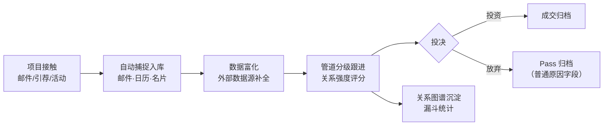
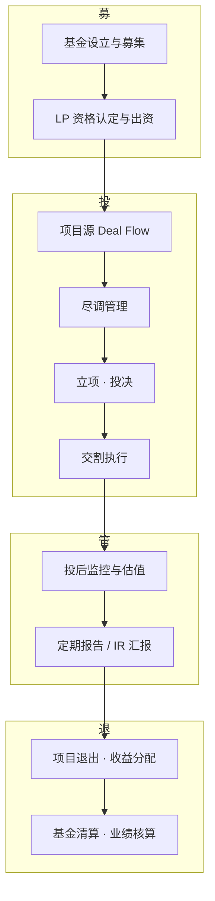
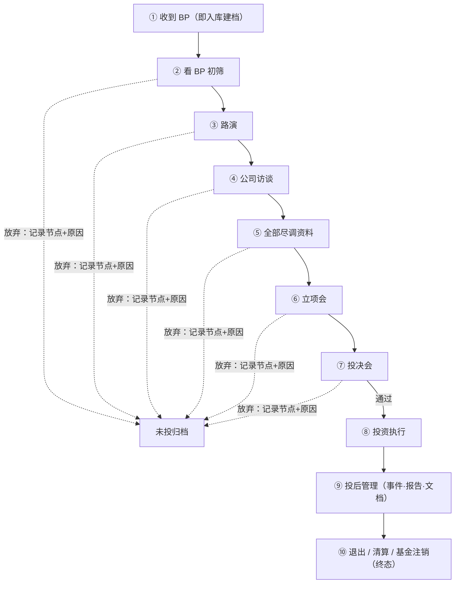

# P1-R01-A01 — 竞品分析（功能层）

| 项 | 内容 |
|---|---|
| 分析日期 | 2026-08-26（V3.2：第三章开头新增「类型速览」表（10 家竞品 × 系统类型 × 阵营/交付 × 需求契合度）；V3.1：按业务确认更新结论口径——Q2 不走第三方采购，本文档定位自建的**功能架构参照**（如需采购须领导层决策），第六章回填 Q4/Q5/Q6/Q8 确认结果；V3.0：附件5 募占位块改为通俗标注「待确认是否需要」；V2.9：募段改紫色、图片路径改根目录相对；更早略） |
| 服务对象 | 投资项目管理系统（项目库）自建需求——投资部，所管理基金为**宏兆集团**（深圳，1995 年创立）旗下基金（详见《P1-R01-A02-原始需求记录》提出背景） |
| 分析类型 | 功能竞品分析（Full Profile + Feature Comparison，依据 competitive-analysis 技能 v1.0.0 工作流） |
| 竞品数量 | **10 家全量档案**（4 国际 + 6 国内）+ 6 家国内概览 + 8 类带过 |
| 主文件 | 《P1-R01-方案分析报告.md》第五节 5.2 清单 |

> 数据来源：各产品官网与三轮网络检索（2026-08-25）。所有厂商定价均不公开（销售报价制），定价栏以模式描述为准。竞品情报具有时效性，功能架构参照引用前须复核。

---

## 一、执行摘要

本项目所需的「项目库」对应成熟品类：**VC/PE CRM（轻量管道派）**与**机构级 Front-to-Back 系统（全流程派）**，国内另有金融 IT 巨头与垂直厂商构成的四层格局。功能核查表明：领导提出的"BP 即入库 + 放弃节点与原因 + 投后全记录至清算注销"完整横跨两个阵营——前半段（Deal Flow + Pass Reason）是 CRM 派标准形态，后半段（投后到基金清算）只有 Front-to-Back 派覆盖，**没有任何单一轻量产品同时覆盖两端**；而国内全量档案核查（恒生、璞华易投、蓝凌等）证实：**私有化部署 + 投后到清算闭环在国内有多个成熟供给**；经业务确认（Q2，2026-08-25）不走第三方采购，本文档定位为**自建的功能架构参照**（如后续需评估采购，须报领导层决策）。

> 图：系统类型 × 投资部需求——「方案A 轻量管道派 / 方案B 全流程派 / 方案C 投资部需求」三线并列，统一按「募/投/管/退 + 支撑」分段命名；箭头表示段位自上而下流转（募→投→管→退），绿色箭头为放弃分支（投段 → 不投原因记录），虚线短接为支撑层挂接；相同功能同色（募紫、管道蓝、投后橙、清算红、支撑灰），不投原因分类记录（Pass Reason）为投资部独有（绿色高亮），虚线框为该段缺失/待确认（文字置灰、保留段位底色）；高清原文件 [`P1-R01-F01-类型架构对比图.html`](./P1-R01-F01-类型架构对比图.html)（浏览器打开可缩放查看）。

**关键发现**：

1. 五家国际 + 五家国内全量档案的定价**全部不公开**（销售报价制）；国际产品均为 SaaS——Q2 已确认私有化部署，国际产品不适用；
2. "宽口径入库 + 管道阶段 + 时间戳"是全品类标配；**Pass Reason（放弃原因结构化分类 + 统计）没有竞品做成一等公民**——自建把它做成结构化原因树即成差异化亮点；
3. 国内四层格局中，璞华易投/蓝凌/恒生的投后与基金清算模块覆盖度远超预期（蓝凌甚至有"基金清算分配、基金业绩核算"专模块）——需求后半段的成熟模块可直接作自建的**功能架构参照**，前半段（Pass Reason 亮点）是自建价值所在（Q2 已确认不走采购）；
4. AI 能力已成品类趋势（Affinity Ascend、eFront Copilot、璞华易投 AI 评级），且 Affinity 已开放 MCP——与 AI 知识库项目的协同经 MCP 接口级调用实现（两系统独立建设，见主报告 V1.2 第六节）。

## 二、市场概览

### 2.1 品类定义

股权投资管理系统（PE/VC Investment Management System）。本项目需求对应其中三段：Deal Flow 管理 + 投后管理（Portfolio Monitoring）+ 基金生命周期。需求表述与行业术语对应：

| 原始需求表述 | 行业术语 |
|---|---|
| 收到 BP 就丢进去 | Deal Flow / Pipeline Management，宽口径入库 |
| 记录放弃的时间节点 | 阶段管理 + 漏斗转化（Funnel） |
| 记录不投的原因 | Pass Reason（淘汰原因分类） |
| 投后全部内容记录 | Portfolio Monitoring |
| 直至清算、注销基金 | 基金生命周期 + 退出管理（Fund Lifecycle / Exit） |

### 2.2 竞争格局

国际两阵营（CRM 派 vs Front-to-Back 派）；国内四层：垂直 SaaS、企业级私有化项目制、生态协同、金融 IT 巨头与数据服务派。

### 2.3 市场全景对比表

**国际阵营概览**（按需求契合度排序；档案详见第三章）：

| 产品 | 阵营 | 核心能力 | 部署形态 | 定价模式 | 需求契合度 |
|---|---|---|---|---|---|
| eFront | Front-to-Back | 募投管退全流程、基金台账估值、LP 汇报、Copilot | Aladdin 云为主 | 按模块企业级销售 | 中（功能覆盖最高，落地条件不符） |
| Affinity | VC/PE CRM | 自动捕捉、关系智能、数据富化、Ascend 智能体、MCP 开放 | 多租户 SaaS | 按席位订阅（询价） | 中低 |
| 4Degrees | VC/PE CRM | 轻量管道、4000+ 信号提醒、插件生态 | 多租户 SaaS | 订阅（询价） | 低 |
| DealCloud | 专业服务 CRM | Pipeline、募资 IR、多区域云、合规周边 | 多区域云 SaaS | 企业级订阅（询价） | 低 |
| （带过）Dynamo、Allvue | Front-to-Back | 同 eFront 阵营 | — | — | — |
| （带过）iLevel、Solovis | 投后监控专项 | 投后数据/估值 | — | — | — |

**国内阵营概览**（四层，★ 行按需求契合度排序；契合度仅对全量档案对象评定，档案详见第三章）：

| 系统 | 层 | 核心能力 | 部署形态 | 定价模式 | 需求契合度 |
|---|---|---|---|---|---|
| ★蓝凌 VCPE | 私有化项目制 | 募投管退 + LP 出资 + 投后估值驾驶舱 + **基金清算分配** | 本地部署为主（待确认） | 项目制定价 | 高（全场最高） |
| ★璞华易投（方正璞华） | 私有化项目制 | 募投管退全流程、估值/舆情/委派董事、母基金、易投 3.0 | 私有化为主 | 项目制询价 | 高 |
| ★VC800/PEPM | 垂直 SaaS | 母基金/引导基金占有率领先、SAAS 项目管理、FA、LP 门户 | SaaS + 私有云 | 按版本梯度订阅 | 中高 |
| ★恒生电子·股权投资组合管理平台 | 金融 IT 巨头 | 投前/投中/投后组合管理、场外投资、非标资产 | 本地部署/私有化实施 | 按产品组合项目制 | 中 |
| ★鲸准（36氪） | 数据+系统 | 智能投资系统 + 80 万项目数据底座 | SaaS + 定制交付 | 项目制询价 | 中 |
| ★投资云（阅微知行×飞书） | 生态协同 | 项目/投前投后、财报自动收集、基金业绩指标、看板 + 飞书协同底座 | SaaS（飞书 ISV 应用） | 订阅（试用+400 询价） | 中低 |
| 元粟 | 私有化项目制 | 投资全生命周期管控 | 项目制（私有化/定制） | 询价 | — |
| 慧投 VC | 垂直 SaaS | 投资管理、基金报告自动生成、可视化 | SaaS | 订阅 | — |
| 投中锴思 | 数据+系统 | 投资机构管理系统（CVSource 同门） | 待核实 | 待核实 | — |
| 清科 PEDATA/私募通 | 数据服务 | 创投数据库、行研 | 数据终端 | 订阅 | — |
| IT桔子 | 数据服务 | 创投数据库、桔子雷达 | SaaS | 订阅 | — |
| 烯牛数据 | 数据服务 | 科创数据引擎、项目发现 | SaaS | 订阅 | — |
| （带过）金证、金仕达、顶点 | 券商资管 IT | 投资交易/核算（同赛道相邻） | 本地部署 | 项目制 | — |
| （带过）企名片 | 数据+工具 | 创投数据 | SaaS | 订阅 | — |

### 2.4 系统类型与典型流程

**按功能纵深分，市场本质上是 2 大类**：

| 类型 | 特征 | 代表 |
|---|---|---|
| ① 轻量管道派（VC/PE CRM 型） | 以 Deal Flow 与关系管理为中心，宽进、轻快、自动化；投后/基金弱或没有 | Affinity、4Degrees、VC800、慧投 VC |
| ② 全流程派（Front-to-Back 型） | 募投管退全覆盖 + 基金台账/估值/LP 汇报，重实施 | eFront、恒生、璞华易投、蓝凌、元粟 |

叠加交付方式与供给背景，市场可辨识为 **5 种形态**：轻量 CRM SaaS / 机构级全流程私有化 / 生态协同型（飞书 ISV）/ 数据+系统混合型（定制交付）/ 投后监控专项型（补丁类，带过）。本报告 2.3 的"国际两阵营 + 国内四层"即这两个维度的组合表述。

**图 A：轻量管道派典型流程（CRM 型）**

**图 B：全流程派典型流程（Front-to-Back 型，募投管退）**

**图 C：两类系统与投资部需求的架构对比**——已升级为三线并列架构图并移至**文首执行摘要**，统一采用「募/投/管/退 + 支撑」分段命名，箭头表示段位流转、绿色箭头为放弃分支（投段 → Pass Reason）；独立维护文件为《P1-R01-F01-类型架构对比图》（HTML + PNG），本节不再重复维护 mermaid 版本。

> 图 C 读法：投资部需求 = 轻量管道派的「投段管道」+ 全流程派的「管/退段闭环」+ 同类产品均缺失的「不投原因分类记录」（绿色）——这正是"前段像 CRM、后段像 Front-to-Back、灵魂无人做"的可视化表达。

### 2.5 通用模块结构（募投管退 + 支撑层）

综合璞华（十模块）、蓝凌（募投管退+两支撑）、eFront（按环节全覆盖）、VC800（四大产品）的公开模块，本品类系统的标准结构为**四大业务段 + 支撑层，合计 7~8 大模块**：

| 段/层 | 典型模块 | 竞品出处 |
|---|---|---|
| **募** | 基金募集管理、LP 资格认定、LP 出资管理、LP 门户/IR 汇报 | 蓝凌、VC800（LP 门户）、eFront |
| **投** | 项目档案与项目池、投前管道、尽调管理、立项/投决流程、投资风控 | 全品类；璞华"储备/投前项目管理" |
| **管** | 投后跟踪（事件/报告）、财报收集、投后估值、风险预警/舆情、委派董事、驾驶舱 | 蓝凌、璞华、投资云 |
| **退** | 项目退出、收益分配、**基金清算分配、基金业绩核算** | 蓝凌独家明示 |
| 支撑：协同/OA | 门户、流程审批、日程、公文 | 蓝凌、投资云 |
| 支撑：知识文档 | 文档中心、案例中心、云端知识库 | VC800、蓝凌（与 AI 知识库项目结合点） |
| 支撑：数据集成 | 外部数据富化、API/MCP | Affinity、数据服务派 |
| 支撑：统计决策 | 漏斗、组合看板、指标分析 | 全品类 |

**图 D：投资部需求全流程**（原始需求 R1~R6 的可视化；②~⑦ 任一阶段均可放弃）

**与投资部方案的映射**：主报告第四节功能模块总览七模块（项目档案/管道/放弃管理/投后/退出终态/统计/权限）对应"投、管、退 + 统计权限支撑"，**暂缺"募"段**（LP 管理）——原始需求未提，但结合宏兆背景（多分支、基金维度 Q7）建议以 Q11 确认是否列入 V2.0。全量功能点与 V1.0/V2.0 的逐条对照见《P1-R01-A04-功能清单对照表》。

## 三、竞品档案（10 家全量：4 国际 + 6 国内，**按需求契合度降序排列**）

> **需求契合度分级口径**（对照投资部原始需求的 6 项功能特征：① BP 即入库 ② 投前管道+时间戳 ③ 放弃原因结构化 ④ 投后全记录 ⑤ 清算/注销终态 ⑥ 私有化+中文）：**高**＝命中 ≥5 项且含 ⑤；**中高**＝命中 4 项；**中**＝命中 2~3 项或功能够但落地条件不符；**中低/低**＝命中 ≤2 项或关键前提（部署/语言）不满足。注：③ 在全市场为空白，不计入任何竞品命中项。

**类型速览**（各竞品所属系统类型 × 阵营/交付 × 需求契合度，类型定义见 2.1~2.4，契合度口径见下方注）：

| 竞品 | 系统类型 | 阵营 / 交付 | 需求契合度 |
|---|---|---|
| 蓝凌 VCPE | 全流程派 | 国内 · 私有化项目制（OA 巨头） | **高**（全场最高） |
| 璞华易投 | 全流程派 | 国内 · 私有化项目制 | 高 |
| VC800 / PEPM | 轻量管道派 | 国内 · 垂直 SaaS（+私有云） | 中高 |
| eFront | 全流程派 | 国际 · Aladdin 云（机构级） | 中 |
| 恒生电子 | 全流程派 | 国内 · 金融 IT 巨头（私有化实施） | 中 |
| 鲸准 | 数据 + 系统混合型 | 国内 · SaaS + 定制交付 | 中 |
| Affinity | 轻量管道派（CRM） | 国际 · 多租户 SaaS | 中低 |
| 投资云 | 生态协同型 | 国内 · 飞书 ISV（SaaS） | 中低 |
| 4Degrees | 轻量管道派（CRM） | 国际 · 多租户 SaaS | 低 |
| DealCloud | 轻量管道派（专业服务 CRM） | 国际 · 多区域云 SaaS | 低 |

### 3.1 蓝凌 VCPE 投资管理系统（OA 巨头的行业方案｜契合度：高（全场最高））

| 属性 | 详情 |
|---|---|
| 公司背景 | 蓝凌软件（国内 OA/知识管理大厂），VCPE 为其行业解决方案 |
| 目标客户 | VC/PE 投资机构；标杆案例：**华润资本（全周期管理、各基金差异化流程）、基石资本（统一基金/项目台账、风险预警、标准化数据中心）、青橙资本**；页面另列 20 余家客户 |
| 核心模块 | 按"募投管退"+两大支撑：**募**（基金募集、基金财务、投资决策、LP 资格认定、LP 出资）；**投**（项目管理、投资过程、投资风控、合作渠道、并购）；**管**（投后日常跟踪、投后财报、经营报告、投后估值、驾驶舱）；**退**（项目退出、收益分配、收益统计、**基金清算分配、基金业绩核算**）；协同管理（门户/流程/日程/周报/公文）；知识管理（案例中心/文档中心/行业研究） |
| 部署形态 | 官网未明示（有云端 demo 体验入口）；按蓝凌传统以本地部署/私有化交付为主，需向厂商确认 |
| 优势 | **唯一把"基金清算分配、基金业绩核算"列为明示模块的竞品**——与本项目"直至清算、注销基金"终态直接对口；投后估值+驾驶舱完整；OA 协同与知识管理天然集成（与本机构知识库项目互补） |
| 劣势 | 行业方案非独立产品公司，迭代节奏取决于蓝凌主线；产品化程度与私有化细节需售前确认 |
| 需求契合度 | **高（全场最高）**（命中①②④⑤⑥——唯一清算明示模块，约 80% 覆盖；③ 空白；体验偏 OA 审批风格） |
| 定价 | 不公开，项目制定价 |
| 竞争策略 | 复用 OA 客户关系做行业化方案销售，以"协同+知识管理"差异化于纯投资系统厂商 |
| 信息置信度 | 高（官网方案页核实；部署形态待确认） |
### 3.2 璞华易投（方正璞华 · 私有化项目制代表｜契合度：高）

| 属性 | 详情 |
|---|---|
| 公司背景 | 璞华科技（方正璞华），私募股权投资管理系统平台提供商，产品已迭代至**璞华易投 3.0** |
| 目标客户 | 国资国企、PE/VC、母基金（FOF）、产业引导基金、政府投资基金、产业资本、金控集团 |
| 核心模块 | 直投业务平台：**储备项目管理、投前项目管理、投后项目管理、项目估值管理、指标分析管理、舆情风险管理、收益分析管理、委派董事管理、母基金管理、基金管理**；投研分析、风控管理、收益测算；模块化设计兼顾监管合规与机构差异化配置 |
| 部署形态 | 私有化/项目制交付为主 |
| 优势 | 募投管退全流程模块清单完整（含估值、舆情、委派董事等深水区功能）；国资/政府基金客户群深厚；官方建议的实施路径（先项目管理+基金基础，再扩展）与本项目 V1.0/V2.0 规划一致；已有 AI 能力（被第三方评为兼顾实用性/合规/性价比的一级市场 AI 投资管理系统） |
| 劣势 | 无公开定价与自助试用（纯项目制）；SaaS 轻量版缺位；品牌知名度限于行业内 |
| 需求契合度 | **高**（命中①②④⑥，⑤ 有基金管理但清算未明示——约 75% 覆盖；③ 空白） |
| 定价 | 不公开，项目制询价 |
| 竞争策略 | 以"合规 + 模块化可配置"切国资与政府基金，用行业模板降低实施成本 |
| 信息置信度 | 高（官网与官方新闻核实） |
### 3.3 VC800 / PEPM（垂直 SaaS，母基金/引导基金占有率领先｜契合度：中高）

| 属性 | 详情 |
|---|---|
| 公司背景 | vc800.com / pepm.com.cn，宣称约 3000 家机构入驻 |
| 目标客户 | 母基金/引导基金（宣称行业占有率领先）、VC/PE；已服务毅达资本、元禾辰坤、德同资本、天图投资、中信建投资本、上海科创基金、湖北高投、通和毓承等；另有 FA、金控、国资、AMC、家办等扩展线 |
| 核心模块 | 四大核心产品：**母基金（FOF/引导基金）系统、SAAS 股权投资项目管理系统、FA 投行业务系统、LP 门户（投资人关系）**；投资全流程管理（潜在项目→投资→分析控制）、类微信协作、云端投资知识库、移动审批/任务分派；安全：实时+冗灾备份、SSL、数字证书 |
| 部署形态 | SaaS 主推 + 私有云选项（官网含苏州私有云入口）；移动端五通道（小程序/服务号/企业号/APP/浏览器） |
| 版本梯度 | pepm_light（轻量）/ standard（标准+OA）/ advanced（金控）/ pro（门户）/ lead（AMC），页面未列各版差异 |
| 优势 | 国内垂直 SaaS 中产品线最全、客户名单最实；母基金/引导基金场景沉淀深；LP 门户独立成产品；移动端通道最多 |
| 劣势 | 投后深度模块公开信息有限；版本差异不透明；无公开定价 |
| 需求契合度 | **中高**（命中①②⑥，母基金/引导基金场景契合 Q7；④⑤ 部分待核实，③ 空白） |
| 定价 | 不公开，按版本梯度订阅（试用申请 + 0512 电话询价） |
| 竞争策略 | 以母基金/引导基金标杆客户打行业占有率，SaaS 低门槛获客后向版本梯度与扩展线增收 |
| 信息置信度 | 高（官网核实） |
### 3.4 eFront（BlackRock/Aladdin 旗下 · 机构级 Front-to-Back｜契合度：中）

| 属性 | 详情 |
|---|---|
| 目标客户 | GP/VC/不动产基金/母基金 + LP 端（养老金/保险/主权）+ 服务商 |
| 核心模块 | 按环节覆盖全生命周期：募资、投资（Deal Flow/尽调）、投后（Portfolio Monitoring/持仓/流动性）、基金管理与估值、LP 汇报（投资人门户）、ESG、Copilot（GenAI） |
| 部署形态 | 以 Aladdin 云生态为主（官网未明示；机构级产品传统上有本地实施先例，需询价确认） |
| 优势 | **唯一完整覆盖本项目需求全段（含基金清算注销所在的基金台账域）的国际竞品**；LP 汇报与估值为强项；Preqin 数据内置 |
| 劣势 | 机构级实施，重且贵；Deal Flow 体验不如 CRM 派轻快 |
| 需求契合度 | **中**（④⑤ 覆盖最完整，② 偏弱、① 偏重；功能够但⑥不满足——Aladdin 云为主、无中文，落地条件不符） |
| 定价 | 不公开，按模块组合（Insight/Invest GP/LP/AS）企业级销售 |
| 竞争策略 | 依托 BlackRock/Aladdin 生态做"数据+系统+估值"一体化，锁定大型机构 |
### 3.5 恒生电子 · 股权投资组合管理平台（金融 IT 巨头｜契合度：中）

| 属性 | 详情 |
|---|---|
| 公司背景 | 恒生电子（A 股 600570），金融 IT 龙头，资管投资管理系统（O32/O45）市占率头部；同赛道还有金证股份、金仕达、顶点软件 |
| 目标客户 | 券商私募子公司、另类投资子公司、私募股权机构、银行/信托/金控 |
| 核心模块 | 股权投资组合管理平台（官网产品列表明示覆盖**投前、投中、投后**，NEW 标签）+ 场外投资管理系统 + 非标资产管理系统 + i私募系列（运营通/证券投资管理）；相邻产品线：私募集中交易、收益互换、量化平台 |
| 部署形态 | 企业级本地部署/私有化实施（金融 IT 传统交付模式） |
| 优势 | 体量与交付能力最大；私有化与合规经验最深（服务持牌机构）；产品矩阵全（从投资到交易核算） |
| 劣势 | 面向持牌/大型机构，小团队采购门槛高；Deal Flow 轻量体验非其传统强项；实施周期与费用预计为国内最高档 |
| 需求契合度 | **中**（④⑤ 深度最强、⑥ 满足；① 与"丢进去"的轻量感不符、② 偏重、③ 空白；采购门槛最高） |
| 定价 | 不公开，按产品组合项目制销售 |
| 竞争策略 | 依托券商/银行客户关系做交叉销售；其联创公开对标"贝莱德收购 eFront 并集成进 Aladdin"，走 Front-to-Back 整合路线 |
| 信息置信度 | 高（官网产品列表核实；模块细节需售前确认） |
### 3.6 鲸准（36氪旗下 · 国内数据+系统｜契合度：中）

| 属性 | 详情 |
|---|---|
| 目标客户 | 国内 VC/PE/FOF/引导基金/券商/银行；案例：北京科创投（300 亿母基金）、三峡资本、君义投资 |
| 核心模块 | 智能投资系统（投资管理/风控/行业研究/基金尽调整体方案）+ 数据底座（80 万创业项目、7000 万公司数据）；案例功能含流程定制、审批自定义、FA 项目管理、机构管理、会议管理、CRM、路演管理 |
| 部署形态 | SaaS + 大客户项目制定制交付（私有化可谈，三峡案例即为定制实施） |
| 优势 | 中文本地化与国内数据生态；有国内大客户定制交付先例；数据+系统打包 |
| 劣势 | 官网未明确投后专项模块；产品化文档透明度低（案例导向营销）；定制交付周期长（三峡案例 8 个月余） |
| 需求契合度 | **中**（①⑥ 满足——中文、定制可私有化；②④ 为 ⚠️、⑤ 未明示，需定制补齐） |
| 定价 | 不公开，400 电话询价（项目制定制交付推断） |
| 竞争策略 | 以 36氪系数据流量获客，大客户走"数据+定制系统"整体方案 |
### 3.7 Affinity（美国 · VC/PE CRM 头部｜契合度：中低）

| 属性 | 详情 |
|---|---|
| 目标客户 | PE/VC/私募信贷/CVC/投行/家办/母基金；官方背书 3,300+ 私募机构 |
| 核心模块 | CRM、管道管理、活动自动捕捉（邮件/日历全量）、关系智能（关系强度评分）、数据富化（Pitchbook/Preqin/Grata 等 40+ 源）、Ascend 智能体、分析报表、API/MCP 开放平台 |
| 部署形态 | 多租户 SaaS（官网未见私有化选项） |
| 优势 | 自动化程度最高（会议后自动更新管道）；数据富化生态最全；已支持 MCP 连接 Claude 等 AI 工具 |
| 劣势 | 投后与基金管理非其重心；SaaS-only，无私有化；数据出境不满足国内合规要求 |
| 需求契合度 | **中低**（命中①②；③空白、④⑤缺失、⑥不满足——SaaS 无私有化/中文。若 Q2 放宽 SaaS 可升为"中"） |
| 定价 | 官网不公开，销售报价（行业口碑为按席位订阅制，中高价位） |
| 竞争策略 | 以"关系智能 + 自动化"降低投资人录入负担，用数据网络效应绑定机构 |
### 3.8 投资云（阅微知行 × 飞书 · 生态协同型｜契合度：中低）

| 属性 | 详情 |
|---|---|
| 公司背景 | 阅微知行，VC/PE 行业中飞书**唯一官方 ISV 伙伴**；2022 年前以定制化软件为主，通过自研无代码平台交付；伙伴口径累计服务 400+ 客户、签约机构 300+ |
| 目标客户 | 私募股权投资机构（含子基金项目管理）；使用人群覆盖投前/投后、IR、财务、基金运营、合伙人 |
| 核心模块 | 项目管理 / 投前 / 投后管理（投资流程协同、管理与追踪）；**被投企业财务报表自动批量收集**（替代投后重复工作）；基金业绩指标（实时刷新、自动计算）；数据分析看板（可配置）；基金管理；办公协同（飞书底层：IM/文档/多维表格/视频会议/知识库） |
| 部署形态 | 完整 SaaS 方案（飞书 ISV 应用形态，挂载 app.feishu.cn） |
| 优势 | 与飞书深度打通（账号/消息/文档零切换），员工使用门槛最低（针对"定制系统用不起来"痛点）；投后财报自动收集 + 基金业绩自动计算是实用亮点；无代码平台支撑的配置灵活性 |
| 劣势 | 绑定飞书生态（非飞书机构无法使用）；SaaS-only，无私有化选项（Q2 若要求私有化则出局）；放弃/Pass Reason 与基金清算等深度模块未见明示 |
| 需求契合度 | **中低**（①④⑥（若允许 SaaS 且在用飞书）部分契合；③⑤ 弱、绑定飞书——仅当 Q9 确认飞书现状且 Q2 放宽时适用） |
| 定价 | 未公布，"联系我们/立即试用" + 400 热线询价（飞书应用订阅制推断） |
| 竞争策略 | 借飞书在投资行业的渗透（源码资本等 100+ 家 VC/PE 已用飞书）做生态卡位，以"协同底座 + 行业 ISV 应用"降低采购与使用双重门槛 |
| 名称辨析 | 鲸准亦联合飞书推出过同名"投资云"产品（jingdata.com/feishu）——检索与选型时须以厂商（阅微知行 vs 鲸准）区分，勿混淆 |
| 信息置信度 | 高（飞书官网产品页核实） |
### 3.9 4Degrees（美国 · 轻量 VC/PE CRM｜契合度：低）

| 属性 | 详情 |
|---|---|
| 目标客户 | PE/VC/投行/商业地产/咨询 |
| 核心模块 | Deal Flow 管理、管道快照、关系强度评分、4000+ 信号提醒（职位变动/新闻）、Gmail/Outlook/LinkedIn/Chrome 插件、报表、Salesforce 集成、移动端 |
| 部署形态 | 多租户 SaaS（含插件与移动端） |
| 优势 | 轻量易上手，插件生态贴近投行人日常；交易停滞自动提醒（可参考用于投后跟进提醒 Q8） |
| 劣势 | 无投后/基金模块；数据源丰富度弱于 Affinity；SaaS-only |
| 需求契合度 | **低**（仅①②部分契合；④⑤缺失，⑥不满足） |
| 定价 | 官网不公开（有独立定价页，销售驱动） |
| 竞争策略 | 以轻量 + 插件矩阵切入中小机构，靠日常工具（邮箱/LinkedIn）习惯迁移降低 switching cost |
### 3.10 DealCloud（Intapp 旗下 · 专业服务级 CRM｜契合度：低）

| 属性 | 详情 |
|---|---|
| 目标客户 | 私募资本全谱系 + 投行/会计咨询/法务（覆盖面最宽） |
| 核心模块 | 关系管理、业务拓展与市场、Pipeline 与交易管理、募资与投资者关系、体验管理；底层数据基座（Applied AI、数据架构、集成）；周边配套 Intapp 合规产品线（利益冲突、信息墙） |
| 部署形态 | 多区域云 SaaS（US/EU/AE/AP 四区） |
| 优势 | 多区域合规云；与 Microsoft 365 深度集成；合规周边完善 |
| 劣势 | 投后/基金核算不深；实施较重；SaaS |
| 需求契合度 | **低**（② 契合但面向专业服务场景；④⑤缺失，⑥不满足） |
| 定价 | 不公开，销售报价 |
| 竞争策略 | 绑定 Intapp 专业服务合规生态，面向受监管机构做"CRM+合规"捆绑销售 |
### 3.11 带过竞品

Dynamo、Allvue（Front-to-Back）；iLevel/Diligent、Solovis（投后监控）；元粟、慧投 VC、投中锴思（国内，见 2.3 概览）；清科 PEDATA、IT桔子、烯牛数据、企名片（数据服务派）；金证、金仕达、顶点（券商资管 IT 相邻赛道）。选型深入阶段再展开。
## 四、功能对比矩阵

### 4.1 国际阵营（18 维，含需求基准列）

（与 V1.x 相同矩阵，保留）对比基准列「本项目需求」取自主报告第四节功能模块总览：

| # | 功能维度 | 本项目需求 | Affinity | 4Degrees | DealCloud | eFront | 重要性 |
|---|---|---|---|---|---|---|---|
| 1 | 宽口径入库（BP 即建档） | ✅ | ✅ | ✅ | ✅ | ⚠️ | 高 |
| 2 | 投前管道 + 自定义流程 | ✅（10 段可配） | ✅ | ✅ | ✅ | ⚠️ | 高 |
| 3 | 放弃节点 + 时间戳 | ✅（一等公民） | ⚠️ | ⚠️ | ⚠️ | ⚠️ | 高 |
| 4 | 放弃原因结构化 + 统计 | ✅（一等公民） | ⚠️ | ⚠️ | ⚠️ | ⚠️ | 高 |
| 5 | 邮件/日历自动捕捉 | —（V2.0） | ✅ | ✅ | ⚠️ | ❌ | 中 |
| 6 | 关系智能 | — | ✅ | ✅ | ⚠️ | ❌ | 低 |
| 7 | 外部数据富化 | — | ✅ | ⚠️ | ⚠️ | ✅ | 低 |
| 8 | 投后管理 | ✅ | ❌ | ❌ | ❌ | ✅ | 高 |
| 9 | 基金台账/多基金/出资 | ✅（Q7） | ⚠️ | ❌ | ⚠️ | ✅ | 高 |
| 10 | 估值与 LP 汇报 | — | ❌ | ❌ | ⚠️ | ✅ | 低 |
| 11 | 文档库 | ✅ | ⚠️ | ⚠️ | ✅ | ✅ | 高 |
| 12 | 统计报表（漏斗/原因分布） | ✅ | ✅ | ✅ | ⚠️ | ✅ | 高 |
| 13 | AI 能力 | 可选 | ✅ | ⚠️ | ⚠️ | ✅ | 中 |
| 14 | 提醒/预警 | ✅（Q8 已确认） | ✅ | ✅ | ⚠️ | ⚠️ | 中 |
| 15 | Deal 级数据权限 | ✅ | ✅ | ⚠️ | ✅ | ✅ | 中 |
| 16 | API/集成开放 | 待确认 | ✅（含 MCP） | ⚠️ | ✅ | ⚠️ | 中 |
| 17 | 私有化部署 | ✅（Q2 已确认） | ❌ | ❌ | ❌ | ⚠️ | 高 |
| 18 | 中文/本地化 | ✅ | ❌ | ❌ | ⚠️ | ⚠️ | 高 |

### 4.2 国内全量档案阵营（10 维核心比对）

| 功能维度 | 鲸准 | 恒生 | 璞华易投 | VC800/PEPM | 蓝凌 VCPE | 投资云 |
|---|---|---|---|---|---|---|
| 宽口径入库（BP 即建档） | ✅ | ⚠️（机构级流程偏重） | ✅（储备项目管理） | ✅（潜在项目→投资） | ✅（项目池统一管理） | ✅（项目管理入口低门槛） |
| 投前管道 + 自定义流程 | ✅（流程定制） | ⚠️ | ✅（模块化配置） | ✅ | ✅（差异化流程，华润案例） | ✅（无代码配置） |
| 放弃节点 + 原因结构化 | ⚠️ | ⚠️ | ⚠️ | ⚠️ | ⚠️ | ⚠️ |
| 投后管理 | ⚠️（未明示专项） | ✅（投前/投中/投后平台） | ✅（投后项目/估值/舆情/委派董事） | ⚠️（深度待核实） | ✅（跟踪/财报/估值/驾驶舱） | ✅（投后追踪+财报自动收集） |
| 基金台账与清算 | ⚠️（案例含基金投资） | ✅（基金管理与估值产品线） | ✅（基金管理+母基金） | ✅（母基金系统独立产品） | ✅（**基金清算分配/业绩核算**明示模块） | ⚠️（基金业绩指标有，清算未见） |
| 统计报表 | ⚠️ | ✅ | ✅（指标分析） | ✅ | ✅（图表化统计/驾驶舱） | ✅（可配置看板） |
| AI 能力 | ⚠️ | ⚠️ | ✅（AI 评级获第三方好评） | ⚠️ | ⚠️ | ⚠️ |
| 私有化部署 | ⚠️（定制可谈） | ✅ | ✅ | ⚠️（SaaS 主推 + 私有云） | ⚠️（传统本地部署，待确认） | ❌（SaaS-only，绑定飞书） |
| 中文/本地化 | ✅ | ✅ | ✅ | ✅ | ✅ | ✅ |
| 定价公开 | ❌ 询价 | ❌ 项目制 | ❌ 项目制 | ❌ 版本订阅询价 | ❌ 项目制 | ❌ 试用+询价 |

**矩阵解读**：

1. 放弃节点 + 原因（3/4 行）在国内外全品类均为 ⚠️——无一做成结构化一等公民，自建的差异化结论在扩大样本后依然成立；
2. 投后 + 基金清算维度国内私有化阵营（恒生/璞华/蓝凌）全部 ✅——需求后半段模块成熟，可作自建后段的**功能架构参照**（Q2 已确认不走采购）；
3. 私有化 + 中文两维国内阵营天然满足；Q2 已确认私有化且不走采购，功能架构参照优先级与主报告一致：蓝凌（清算模块最对口·契合度全场最高）＞ 璞华易投（模块最全）＞ VC800（契合度第三，见 2.3 概览），恒生（体量最大）同为后段参照对象。

## 五、定价对比

| 阵营/产品 | 定价模式 | 公开价格 | 获取方式 |
|---|---|---|---|
| 国际 CRM 派（Affinity/4Degrees/DealCloud） | 按席位订阅 | ❌ | Demo |
| 国际 Front-to-Back（eFront） | 按模块组合企业级 | ❌ | Book a meeting |
| 国内数据+系统（鲸准） | 项目制定制 | ❌ | 400 询价 |
| 金融 IT 巨头（恒生） | 产品组合项目制 | ❌ | 售前 |
| 国内私有化（璞华/蓝凌） | 项目制 | ❌ | 售前 |
| 国内 SaaS（VC800/慧投/投资云） | 版本梯度/飞书应用订阅 | ❌ | 试用申请 + 电话/400 询价 |

**定价洞察**：全品类 10 家全量档案零公开定价，企业级 B2D 特征显著，无法做公开 TCO 对比；Q2 已确认不走采购，无需 RFP 询价（如后续需评估采购，须报领导层决策，届时需正式 RFP）。量级常识（未证实）：CRM 派数千美元/人/年，Front-to-Back 实施数十万美元级，国内项目制预计数十万人民币级——与自建开发人力成本处于可比区间，**采购并不必然更省，且 Pass Reason 亮点买不来**。

## 六、对本项目的设计启示（映射待确认问题）

| 输入 | 设计启示 |
|---|---|
| Q4 档案字段（✅ 已确认：按行业标准数据建模） | 参考 Affinity/4Degrees 字段族 + 璞华"储备项目管理"的分级理念：项目名/一句话描述/行业赛道标签/轮次/拟投金额/估值/来源渠道/联系人/introducer；V1.0 手动录入 + BP 附件——上述字段族即行业标准字段草案，落入数据模型 |
| Q5 放弃原因分类（✅ 已确认：预置选项 + 自定义补充，预置清单待业务提供） | 全品类无结构化先例，自建原因树初版：**估值过高 / 赛道不符 / 商业模式存疑 / 团队问题 / 竞争格局 / 合规风险 / 时机过早 / 与 portfolio 冲突 / 其他**，两级分类留扩展——可作为预置清单草案提交业务确认 |
| Q6 投后范围（✅ 已确认：按行业标准数据建模） | 璞华（估值/舆情/委派董事）+ 蓝凌（跟踪/财报/估值/驾驶舱）给出行业完整清单；V1.0 先做事件时间线 + 文档归档 + 定期报告提醒 |
| Q7 基金维度（⏳ 待确认） | 蓝凌"基金清算分配/业绩核算"是终态设计的最佳参照；V1.0 简化为"项目↔基金"关联 + 基金状态字段（存续/清算/注销） |
| Q8 提醒（✅ 已确认：需要；V1.0/V2.0 排期待定） | 4Degrees 停滞提醒 + 蓝凌"投后履约与预警管理"印证普遍性；V1.0 做投后报告到期提醒 |
| AI 结合 | Affinity（MCP）/eFront Copilot/璞华 AI 均已落地；BP 自动摘要经知识库侧 MCP 协同实现（两系统独立建设，见主报告 V1.2 第六节） |
| 部署与路线 | Q2 已确认私有化且不走采购：恒生/璞华/蓝凌转为功能架构参照（如需采购须领导层决策）；璞华官方实施路径（先项目+基金基础再扩展）与本项目 V1.0/V2.0 分版规划互相印证；Q9 已确认现状为表格管理——投资云"飞书过渡选项"的前提（深度使用飞书）不成立，不再适用 |

## 七、方法论与局限

- 方法：competitive-analysis 技能 v1.0.0 的 Full Profile + Feature Comparison 流程；信息源为各产品官网与三轮网络检索（2026-08-25），国内新增厂商经官网/官方新闻交叉核实，置信度逐家标注；
- 局限：①官网营销页信息有限，⚠️ 处需公开信息二次核实（蓝凌部署形态、投中锴思整体、VC800 投后深度）；②定价无公开数据；③未实操试用；④带过竞品未深挖；
- 复核建议：Q2 已确认不走采购（如需采购须领导层决策）——不发起演示邀约与报价索取；上述 ⚠️ 存疑处以公开信息复核为准，仅服务功能架构参照。

---

*依据《P1-R01-方案分析报告》第五节生成；主报告待确认问题 Q2/Q4/Q5/Q6/Q8/Q9 已于 2026-08-25 确认并回填本文档结论口径与第六章，Q7 待确认。*
