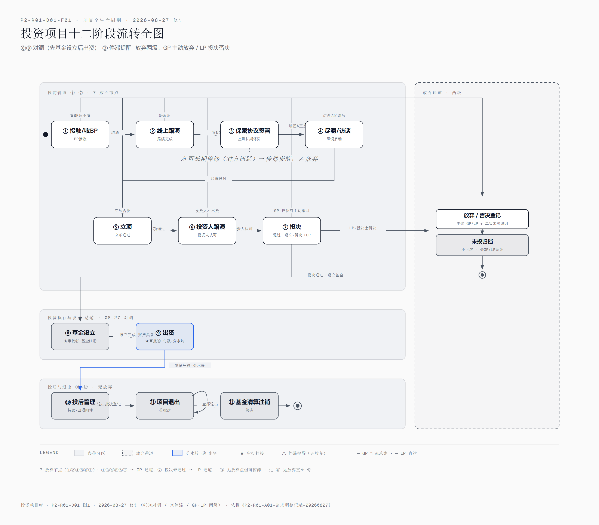
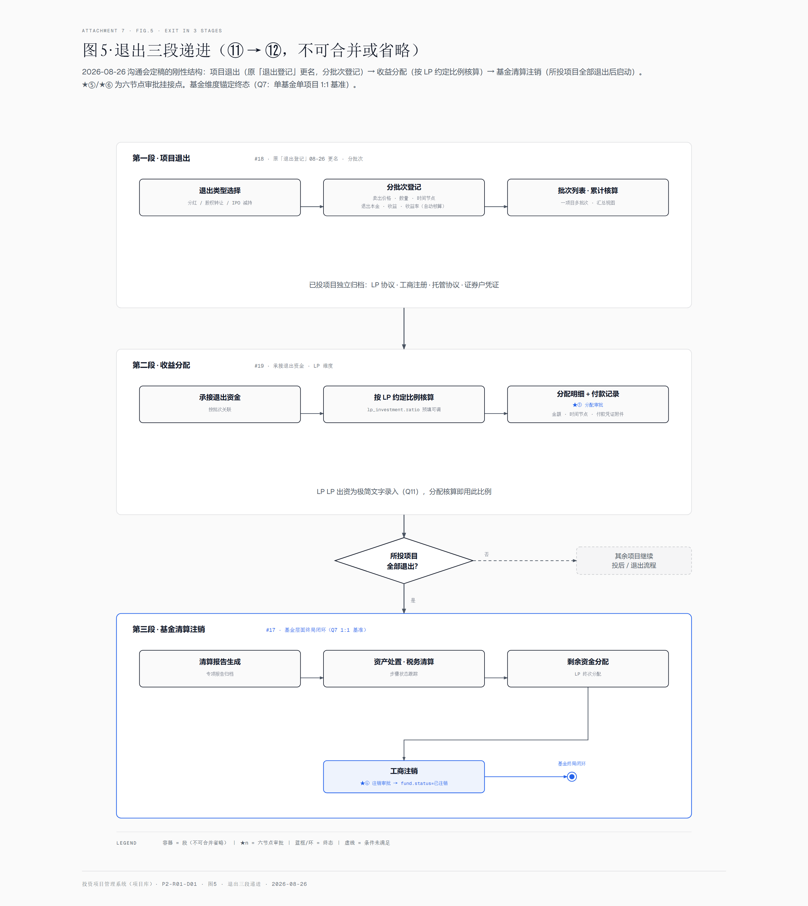

# 投资项目管理系统（项目库）— 产品需求文档（PRD）

| 项 | 内容 |
|---|---|
| 文档编码 | **P2-R01**（阶段·类型编码：项目 02 投资项目管理 · P2 功能调研 · R 主文档 01） |
| 版本 | V1.1（08-27 王总沟通六项调整，见《P2-R01-A01-需求调整记录-20260827》；V1.0 为 08-26 功能调研稿）——**待评审，将与 P3 原型一起评审**（08-27 确认） |
| 日期 | 2026-08-26 建立 · 2026-08-27 修订 |
| 阶段定位 | **阶段2 · 功能调研**（原型绘制前）——阶段1 方案分析已完成，本文档为阶段2 主输出物 |
| 上游 | 《P1-R01-方案分析报告》V1.3 及其附件 P1-R01-A01/A02/A04 与独立产出物 P1-R02 术语表、图 P1-R01-F01/F02 |
| 需求修订 | 08-27 王总沟通：⑧⑨对调（胡博已确认）、阶段停滞提醒、GP/LP 两级原因树、HTML 原型先行、文件知识库化后置 MCP、投标系统不投入——详见《P2-R01-A01-需求调整记录-20260827》 |
| 下游 | 设计文档三件套：P2-R01-D01 项目阶段流转与操作流程图 / P2-R01-D02 数据建模 / P2-R01-D03 功能菜单与字段清单；下一阶段原型绘制 |
| 设计文档 | 《P2-R01-D01-项目阶段流转与操作流程图》《P2-R01-D02-数据建模》《P2-R01-D03-功能菜单与字段清单》 |

## 一、背景与目标

投资部拟自建**投资项目管理系统（业务称呼：项目库）**，实现投资项目全生命周期记录与管理：从接触项目（哪怕只收到一份 BP）即入库建档，跟踪十二阶段推进，未投项目记录放弃节点与结构化原因（全市场空白，核心差异化），已投项目全量投后管理直至基金清算注销。

阶段1（方案分析，2026-08-25/26 完成）已确认：建设路线为**自建方案C**、私有化部署、不走第三方采购（竞品仅作架构参照）、与 AI 知识库系统独立建设（MCP 接口级协同）；需求 Q1~Q11 全部答复完毕。需求基线见《P1-R01-A02-原始需求记录》。

**本 PRD 目标**：定义 V1.0 产品范围与功能/数据/交互需求，作为原型绘制（阶段3）与开发评估的直接输入。

## 二、用户与角色

| 项 | 内容 |
|---|---|
| 使用范围 | 投资部内部，**≤10 人**（Q1 已确认），≤10 并发 |
| 角色模型 | 角色 + 菜单级权限（08-26 确认）；预设角色：投资经理 / 部门负责人 / 管理员 |
| 多分支预留 | 宏兆集团纽约/北京/上海分支的账号权限体系预留扩展位（不阻塞 V1.0） |
| owner 数据权限 | 业务行 owner（负责人）字段＋按 owner 的数据权限模型：谁负责谁可见/可办（09-15 评审 Q26；模型见 P2-R01-D02 3.1/3.17） |
| 登录鉴权 | BS 版 **SSO 优先**（账号密码为备选；09-15 评审 Q27） |

## 三、产品范围（版本边界）

| 版本 | 数量 | 内容 |
|---|---|---|
| **V1.0（本 PRD 范围）** | **18 个功能点** | 原始需求直接要求 11 个（#1~8、10、11、17）+ 08-26 沟通会确认并入 6 个（#14 风险预警、#16 到期提醒≥30天、#18 项目退出、#19 收益分配、#20 募段 LP 极简、#29 六节点在线审批）+ 08-27 新增 1 个（阶段停滞提醒）；放弃原因升级两级（GP/LP × 叶子）；对照见《P1-R01-A04-功能清单对照表》（截至 08-26）+《P2-R01-A01-需求调整记录-20260827》 |
| V2.0 | 8 个功能点 | 估值、原因树自定义扩展（GP/LP 两级已提前至 V1.0，08-27）、标签扩展、驾驶舱、数据富化、AI 摘要、MCP/API、移动端；另含 #29 简道云嵌入深化、文件知识库化（目录树/元数据表经 MCP server 协同，08-27 确认后置） |
| 不做（08-26 确认） | 4 项 + 2 项 | 财报自动收集、委派董事、尽调模板、LP 门户/IR；暂缓：机构管理、投资风控 #9 |
| BS 版二期（09-15 评审批 1） | 3 项 | capital call 催缴全流程（呼叫-确认-实缴核销，Q23；v1 催缴复用「付款节点提醒」）、LP 份额转让（Q24）、统一通知中心（站内信/待办/提醒合一，Q28） |

**业绩测算边界（09-15 评审 Q2）**：本系统（原型与 BS v1）不承担基金业绩精确测算——IRR/DPI 等业绩指标以托管行与审计口径为准；系统侧仅提供基金水位展示（认缴/实缴/已投/剩余可投）与退出批次核算（本金/收益/收益率）。

## 四、功能需求总览（九模块）

| 模块 | 段位 | 要点 | 页面 |
|---|---|---|---|
| 项目档案 | 投 | BP 上传即建档（R1 宽口径）；字段按行业标准（Q4）；材料按资料包六类强制分类（设计原名「逻辑包」，09-01 起 UI 显示名） | P01~P03 |
| 投前管道 | 投 | 十二阶段流转 + 时间戳（R2）；10 个标准状态标签；阶段停滞提醒（08-27：超期未推进触发，③保密协议为典型） | P04/P06 |
| 放弃管理 | 投 | 7 个放弃节点自动带出 + **两级原因树**（GP放弃/LP投决否决 × 各自末级原因，08-27）——**市场空白差异化** | P05 |
| 基金管理 | 投/退 | 20+ 只基金、**基金-项目关联 1:N**（09-15 评审 Q1 定案，原 1:1 基准废止）；基金实体字段 + LPA/工商文件 | P07/P08 |
| 募集期·LP 管理（极简） | 募 | LP 主体/认缴实缴/出资时间文字录入（一 LP 多主体）+ 资质材料 + 资格认定（Q11） | P09/P10 |
| 投后管理 | 管 | 四项刚性功能（08-26）：事件记录、报告归档（手动）、风险预警（股价/舆情）、到期提醒 ≥30天 | P11~P14 |
| 退出管理 | 退 | 三段递进（不可合并省略）：项目退出（分批次）→ 收益分配（LP 比例）→ 清算注销（全部退出后启动） | P15~P17 |
| 统计报表 | 支撑 | 阶段漏斗、放弃原因分布（独有维度·两级：GP/LP × 末级原因，08-27） | P18/P19 |
| 权限 | 支撑 | 角色 + 菜单级；审批中心（六节点在线审批 #29） | P20/P21 |

完整菜单树与 21 页面清单见 **P2-R01-D03 第一节/第二节**。

## 五、核心业务流程

### 5.1 十二阶段流转全图（全生命周期骨架）

① 接触/收BP → ② 线上路演 → ③ 保密协议签署（⚠️ 可长期停滞 → 停滞提醒）→ ④ 尽调资料包/现场访谈（双路径）→ ⑤ 立项 → ⑥ 投资人路演 → ⑦ 投决 → ⑧ 基金设立 → ⑨ 出资（分水岭）→ ⑩ 投后管理 → ⑪ 项目退出 → ⑫ 基金清算注销（终态）。⑧⑨ 于 08-27 对调（先设立具备账户、后出资打款，已与胡博确认）。**7 个放弃节点**（①②④⑤⑥⑦）任一触发 → 放弃登记（主体 GP/LP 自动判定 + 两级原因必填）→ 未投归档（不可回流）。

### 5.2 退出三段递进（⑪→⑫ 刚性结构）

### 5.3 其余流程

投前主流程（④ 双路径 + ★审批挂接）、放弃流程、投后四项、六节点审批流——图示与 mermaid 源码见 **P2-R01-D01**（图 P2-R01-D01-F02~P2-R01-D01-F04/P2-R01-D01-F06）；流转规则、放弃原因预置分类初版见 P2-R01-D01 第一节。

### 5.4 审批节点映射与签批方式（09-15 评审批 1）

- **节点→角色→人映射（Q10）**：审批节点先配置角色、再落到具体人；同一节点多人默认**或签**（任一人通过即过）；**禁自审**——审批人=发起人时拦截；「待我审批」口径＝管理员视角全部待办池（原型演示映射：投决会=胡博/总经理审批=嘉怡/财务审批=胡博/投委会=嘉怡）。
- **签批方式分期（Q11）**：v1 支持或签＋转办；会签、加签二期。

### 5.5 业务规则表（09-15 评审批 1）

| # | 规则 | 来源 |
|---|---|---|
| 1 | 逾期提醒三级递进：7 天提醒 → 15 天升级推送上级 → 30 天再升级 | Q19 |
| 2 | 风险预警处理强制留痕：处理必填说明，处理时限 5 个工作日 | Q20 |
| 3 | 退出批次状态机：待执行/执行中/已完成/已取消；取消与展期为行内留痕操作、不走审批 | Q21 |
| 4 | 实缴≤认缴强校验：LP 实缴金额不得超过认缴金额（表单强校验） | Q25 |
| 5 | 投后事件记录不可变，错误以更正声明（新增更正记录）修正 | Q18 |
| 6 | 合格投资者认定走审批流（总经理审批），有效期默认 24 个月（自认定通过日起算，数值可调） | Q5/Q6 |
| 7 | IPO 减持登记批次强制合规复核 3 勾选（锁定期已满/预披露已完成/90 日额度校验）＋复核人，未全勾拦截 | Q7 |

## 六、数据模型概览

15 个实体覆盖 V1.0 全部功能，建模约定、ER 总图与逐实体字段表见 **P2-R01-D02**：

| 实体组 | 实体 |
|---|---|
| 投资期（原「投段」） | project、stage_transition（+停滞提醒，08-27）、abandon_record（+主体 GP/LP）、abandon_reason（两级：主体×末级，08-27）、material_package/file |
| 基金与募集期（原「募段」） | fund（+币种 Q4）、fund_project（**1:N，09-15 评审 Q1**）、lp_entity（+认定有效期 Q6）、lp_investment；special_term 特殊条款（Q8） |
| 管段 | post_event、post_report、alert_rule、risk_alert |
| 退段 | exit_batch、distribution_item、liquidation |
| 支撑 | approval（六节点多态关联）、sys_user/role/menu |

## 七、界面与信息架构

9 组菜单（项目总库/投前管道/基金管理/LP 管理/投后管理/退出与分配/统计报表/审批中心/系统管理；08-28 移除「工作台」「未投归档」两个菜单，见《P2-R01-A04-需求调整记录-20260828》；09-01 详情页退出菜单——2.2 项目详情/4.2 基金详情页面保留、由列表行进入，见《P2-R01-A05-需求调整记录-20260901》；同日三个单子项组（项目总库/投前管道/基金管理）拍平为一级直达项，一级 9 项 = 6 组 + 3 直达，见《P2-R01-A06-需求调整记录-20260901》；09-02 V1.1 删「投前管道」直达项（看板并入项目列表泳道视图）；09-03「工作台」回填复用 1 号位（F00 登录默认页，一级 9 项 = 工作台 + 2 直达 + 6 组），见《P2-R01-A09-需求调整记录-20260903》；09-04 菜单六项更名（项目总库→项目库、LP 名录→LP 台账、出资记录→LP 出资、投后时间线→投后事项、我的待审/已审→我的审批、字典管理→基础数据），见《P2-R01-A10-需求调整记录-20260904》）+ 21 个核心页面（P01~P21），每个页面定义入口、核心操作、主实体与页面特有项——见 **P2-R01-D03 第二节**；页面↔实体↔功能点映射见 P2-R01-D03 第三节。

## 八、非功能需求

| # | 需求 | 依据 |
|---|---|---|
| 1 | 私有化部署于公司服务器，数据不出域 | Q2 |
| 2 | 与 AI 知识库系统独立建设（独立部署/账号），经 WorkBuddy 调用各自 MCP Server 协同（接口级松耦合，V2.0） | Q3 |
| 3 | 并发 ≤10 人 | Q1 |
| 4 | 数据安全：投资数据不出公司；终态/放弃数据软删除不物理清除（合规留痕） | R1 需求④ / P2-R01-D02 约定 |
| 5 | 自主维护，长期演进依赖内部开发资源 | Q2 |
| 6 | 不与财务/OA/外部监管强制打通；内置六节点审批可独立运行，嵌入简道云 OA「投资产业」板块的方式随 V2.0 深化 | Q10 |
| 7 | 现有 Excel 项目数据迁移 | Q9 |
| 8 | 审计日志：关键操作（审批/认定/退出批次/字典变更等）全量审计留痕（操作人/时间/变更前后值），BS 版实施 | 09-15 评审 Q9 |

## 九、里程碑与待办

| 阶段 | 内容 | 状态 |
|---|---|---|
| P1 方案分析 | 主报告 V1.3 + 附件 A01/A02/A04 + P1-R02 术语表、图 P1-R01-F01/F02（竞品/需求/术语/功能清单/两张架构图） | ✅ 完成 |
| **P2 功能调研（当前）** | 本 PRD + P2-R01-D01/P2-R01-D02/P2-R01-D03 + 图 P2-R01-D01-F01~P2-R01-D01-F06 | ✅ 产出，**待评审** |
| 待办（08-26 会议明确） | 嘉怡 × 胡博以 P2-R01-D03 为底稿对接菜单/字段/原型；胡博牵头协同陈有、华悦确认基金设立与投后字段（P2-R01-D02 3.5~3.12；**⑧⑨顺序 08-27 已确认对调**）；向华悦同步投后四模块规则（P2-R01-D01 2.3） | ⏳ |
| 残留小项 | GP/LP 两级原因树末级原因清单待业务整理（P2-R01-D01 1.2 为素材，08-27 升级两级）；基金清算模块菜单归属待定（投后 vs 基金管理） | ⏳ |
| P3 原型绘制 | **先完成一版 HTML 原型**（按 P2-R01-D03 21 页面，P3-* 编码）供评审测试；测试后再迭代可运行 BS 版（真实数据流转 + BP 资料真实存储，08-27 王总路线） | 未开始 |
| P4 技术方案 | 架构设计 + 自建人天估算 + 简道云嵌入验证 + 数据迁移方案（P4-*） | 未开始 |

## 十、附录：文档体系与编码规则

### 10.1 编码规则

`Pn-类型码序号-中文标题`：Pn=阶段（P1 方案分析 / P2 功能调研 / P3 原型 / P4 技术方案…）。阶段级类型码仅 **R**（序号流水）：**R01=该阶段主文档，R02+=同阶段独立产出文档**（不挂靠任何主文档，如 `P1-R02-术语表`）。

**支撑材料一律挂靠所属文档，格式 `Pn-挂靠文档码-{A|D|F}序号-中文标题`，可多层嵌套（主文档→设计文档→图）**：A=附件、D=设计文档、F=图（HTML 高清 + PNG 双格式）。本项目实例：`P1-R01-A01`（主报告附件）、`P1-R01-F01`（主报告配图）、`P2-R01-D01`（PRD 设计文档）、`P2-R01-D01-F01`（D01 配图，两层挂靠）。序号在各挂靠文档内独立流水，文件名排序即层级归位、前缀即归属；同一材料被多文档引用时以挂靠文档为唯一维护处。已废止形态：阶段级独立 A/F 编码（`Pn-A0N`/`Pn-F0N`）、游离 D 编码（`P2-D0N`）与阶段级 D 编码（当日暂编的 P1-D01，D 仅为挂靠级「设计文档」类型）；P1 附件 A03 术语表已升格为阶段级文档 P1-R02，**A03 空号不复用**。

**目录结构与编码层级一一对应**：阶段级文件（R01 主文档、R02+ 独立产出文档）置于项目根目录；挂靠材料置于以其挂靠文档码命名的文件夹内**平铺**（`P1-R01/`、`P2-R01/`，不再建子层——文件名全码已含完整挂靠链，文件夹仅为物理归位）。

**项目归属由文件夹承载，编码不含项目前缀**：本项目为**项目 02**（`5-【ACTIVE】投资项目管理`），AI 知识库为项目 01（`5-【ACTIVE】AI知识库`），两项目编码规则同构。跨项目引用格式：`项目 NN《Pn-类型码序号-标题》`。两项目存在同名文件（如各自的 P1-R01），以文件夹区分；单独外发文件时需注明所属项目。

### 10.2 文档清单

| 编码 | 路径 | 文档与说明 |
|---|---|---|
| P1-R01 | 根目录 | P1-R01-方案分析报告.md/.docx，阶段1 主文档 |
| P1-R02 | 根目录 | P1-R02-术语表.md，阶段1 独立产出文档（跨阶段术语口径以其为准） |
| P1-R01-A01/A02/A04 | P1-R01/ | 主报告附件：A01 竞品分析 / A02 原始需求记录 / A04 功能清单对照表（A03 空号，术语表已升格） |
| P1-R01-F01/F02 | P1-R01/ | 主报告配图：F01 类型架构对比图 / F02 功能架构图（.html/.png） |
| P1-R01-A05 | P1-R01/ | P1-R01-A05-需求确认速览.html，08-26 会前确认材料存档 |
| **P2-R01** | 根目录 | **P2-R01-产品需求文档.md，本文档** |
| P2-R01-A01 | P2-R01/ | 需求调整记录-20260827.md，08-27 王总沟通六项结论（正式需求记录，原始材料在 99-归档/2026-08-27 …王总沟通/） |
| P2-R01-A02 | agent-handoff/ | 交接文档-20260827.md，项目待办打包（P3 剩余页面/评审决策项/业务依赖/工具备忘），已被 A03 接替，仅存历史参考（08-28 移入 agent-handoff/） |
| P2-R01-A03 | agent-handoff/ | 交接文档-20260828.md，项目待办打包（P3 原型 21/21 页完成、评审动线与决策项、子 agent 工作模式备忘），**新会话接手入口**（08-28 移入 agent-handoff/） |
| P2-R01-A04 | P2-R01/ | 需求调整记录-20260828.md，移除菜单「工作台」「未投归档」（无对应页面，死链/错链），编号留空不重排，D03/PRD/原型说明已同步修订 |
| P2-R01-A05 | P2-R01/ | 需求调整记录-20260901.md，详情页退出侧栏菜单（2.2/4.2，页面保留、列表行进入），F21 权限树同步删除，编号留空不重排，D03/PRD/原型说明已同步修订 |
| P2-R01-A06 | P2-R01/ | 需求调整记录-20260901.md，三个单子项组（项目总库/投前管道/基金管理）拍平为一级直达项（一级 9 项 = 6 组 + 3 直达），F21 权限树同步拍平；含 F04 下线采纳（并入 F02/F03 右栏）与 A03 备份目录记录勘误两事件 |
| P2-R01-A07 | P2-R01/ | 需求调整记录-20260901.md，UI 显示词行业化（A 类：逻辑包→资料包、叶子原因→末级原因、投段/募段→投资期/募集期等；B 类：待上会统一、停留/停滞按阈值区分）；C 类业务口径词不动；术语表新增映射 3 词条 |
| P2-R01-A08 | P2-R01/ | 需求调整记录-20260902.md，UI 用词二次统一（第一轮零回归复核 + 1336 词条全量补漏：A 类 4 项——批量列表→列表视图、文字式录入→中文大写录入、出境备案→ODI、期望持股→拟持股比例；B 类 19 项——投委会→投决会、记付款→登记付款、出资凭证→实缴凭证等；投资执行段与「看 BP 后不看」裁决维持）；术语表新增映射 3 词条 |
| P2-R01-A09 | P2-R01/ | 需求调整记录-20260903.md，行业调研落地（源：GLM/Kimi 双子代理调研 `.research/` 两份报告，16 条编号建议）：审批语义双轨（F20 通过/退回/否决三卡 + 撤回 + 抄送我第四视图）、F02/F03 审批闭环文案、F14/F21 审批超时提醒与超时升级、新建 F00 工作台登录默认页并全站侧栏回填（一级 9 项）；6/7/9/10 号建议不采纳（含二次投决口径维持不可回流） |
| P2-R01-A10 | P2-R01/ | 需求调整记录-20260904.md，菜单命名行业通用性调研落地（双代理 A 国际/B 国内 24 条全量对比，报告与交叉汇总表在 `.research/`）：六项更名——项目总库→项目库（双共识最偏离项）、我的待审/已审→我的审批（对齐钉钉/泛微/企微）、字典管理→基础数据（开发框架词出前台）、LP 名录→LP 台账、出资记录→LP 出资、投后时间线→投后事项；19 页侧栏+页面标题+权限树 132 处替换，D01 页面关系图同步（补 F00、基线 V1.3） |
| P2-R01-A11 | P2-R01/ | 需求调整记录-20260904.md，术语全项目统一（D01 流程图 md+配图 4 HTML 统一旧词并重出 PNG、P1-R01 术语口径段括注、术语表声明历史层映射例外）+ 原型标注层上线（13 页 28 处说明性文字迁入可开关注释层，标注数据 P3-R01-D02，20 条含 FP·REQ 编码展开） |
| P2-R01-A12 | P2-R01/ | 需求调整记录-20260907.md，原型五组改造：新建 F22 投后项目/F23 退出项目两段列表页（方案 A 两层结构，F11/F15 降详情页）+ 菜单结构调整（投后 4 项/退分 3 项/审批单项，F21 权限树同步）+ F10 金额输入反转（数字+中文大写并存）+ 目录重构 P3-R01-原型（一级菜单九文件夹）+ admin-ui-spec 践行评估 + D04 业务流程导航图（D01/D03-演示导览 移 99-归档） |
| P2-R01-A13 | P2-R01/ | 需求调整记录-20260908.md，命名合规治理 P0/P1（09-12 执行）：F20 视图名/F00 我发起的/F09 合格投资者认定/F21 字典族→数据族/F22F23 段切片文案/F01 已投（出资后）/F02F03 项目概况落地/四文件重命名（F02 项目概况/F09 LP台账/F10 LP出资/F11 投后事项）；P2 待议七项落 A13 |
| P2-R01-A14 | P2-R01/ | 需求调整记录-20260912.md，原型演示前完善（G02）：T0 执行 A13＋_demo_ 六件出清＋P3-R02 演示场景覆盖梳理（63 场景）＋P2-R01-D04 闭环检查报告＋R-01 阶段名对齐（F18/F15 共 5 处）＋F24 登录页（22 页） |
| P2-R01-A15 | P2-R01/ | 需求调整记录-20260912.md，审批中心菜单拍平（道远拍板）：单子项组→一级直达项（21 页侧栏＋F21 权限树保留 ap-new＋D03 注记）；同场登记退出与分配命名调研结论（维持现状） |
| P2-R01-A16 | P2-R01/ | 需求调整记录-20260912.md，退出与分配组更名「退出管理」（道远拍板，对照南天/璞华/eFront 惯例）：文件夹＋64 路径＋21 侧栏组名＋F21 权限树＋F23 tip＋D03/PRD 同步；子项不变 |
| P2-R01-A17 | P2-R01/ | 需求调整记录-20260914.md，演示闭环修复（goal G03，09-14 诊断四因）：_data/demo-data.js 单源数据层＋15 页接入（零丢失 15/15）＋页内真联动（F20 审批迁移/F01 推进放弃/F15/F12 新增行）＋查看类 alert 97 处清零改真弹窗＋统计互溯（F01 补 8 行/F19 徽标推导/F18 口径注记）＋P3-R02 开场声明；联动边界=页内内存态 |
| P2-R01-A18 | P2-R01/ | 需求调整记录-20260915.md，侧栏 LP 管理拍平（用户拍板：一级直达 F09，删箭头/子菜单，F09/F10 selected）＋审批中心直达修复（补齐 A15 落位：21 页跳转 F20＋F20 selected）＋F09/F10 页签互达；权限树 lp 组保留；一级 9 项=4 直达＋4 组 |
| P2-R01-A19 | P2-R01/ | 需求调整记录-20260915.md，系统管理拆分两页（用户拍板：F21 更名用户与角色＋新建 F25 基础数据，页内 tab 出清，两子项各自直达各自 selected）；顺手修复 #dictNote 缺失存量 bug；D02 标注随迁 F25；页面数 22→23 |
| P2-R01-A20 | P2-R01/ | 需求调整记录-20260915.md，数据字典与全量数据驱动（用户拍板，goal G05）：基础数据更名「数据字典」（翻转 A10，F25 文件 git mv）；demo-data.js dictionaries 单源 16 分类＋F25 DM 渲染＋新增项联动；13 处枚举下拉 dmFillSelect 驱动（零丢失 13/13）；枚举盘点「不入」边界表；页面级降级 2 页（F02/F14，静态留档）；驱动 10/12 |
| P2-R01-A21 | P2-R01/ | 需求调整记录-20260915.md，评审决策落地与字典 v2（goal G06）：模拟评审 28 问批 1 结论落档（建模 1:N/业绩边界/币种/认定审批化＋24 个月/减持合规复核/审计日志 NFR/节点→人映射/逾期三级/批次状态机/SSO/通知中心等）＋A20 待议 #1/#3/#4 关闭；字典 v2（apType 7 项全称＋slaHours＋ruleType＝17 分类）；九处页面小改＋两笔数据修复；23 页回归 PASS |
| P2-R01-A22 | P2-R01/ | 需求调整记录-20260914.md，国内 SaaS 功能差异调研执行档案（goal G04）：竞品池 11 家（本地 10＋网络 1 清科 MAST）＋国际对照 3 家；矩阵 32 行判定四值（对齐 17/领先 2/缺失 9/深度差距 4）＋三清单（缺失 D-01~09／特色 S-01~03／深度差距 G-01~08）＋演示话术 9 条＋V2 建议 P0/P1/P2；原型零改动 |
| P3-R01-D02 | P3-R01-原型/ | 原型标注数据.json，原型注释层唯一维护处（20 条标注/13 页，编码映射 P01~P21/A01/A09/Q7；09-07 A12 更正 F10 条目并重注入）；改动后重跑原型标注技能注入脚本同步 |
| P3-R01-D04 | P3-R01-原型/ | 业务流程导航图.html，十二阶段主线①~⑫+六节点审批+退出三段+基金-项目 1:1+放弃→未投归档支线，实体节点直达 21 页（09-07 A12 新增，接替 D01-页面关系图） |
| P3-R02 | 根目录 | P3-R02-演示场景覆盖梳理.md，阶段3 独立产出文档（09-12 G02/T2）：63 演示场景×演示动线×覆盖评级（✅61/⚠️2/❌0）×优先级，演示走场手册 |
| P2-R01-D04 | P2-R01/ | 决策落实与场景闭环检查报告.md（09-12 G02/T3，只读检查）：A 系列逐份核查 26 项全落实＋场景闭环核对＋修复建议 R-01~R-09 |
| P2-R01-D05 | P2-R01/ | 国内SaaS功能差异分析报告.md（09-14 G04，只读调研——原型零改动）：功能对照矩阵 32 行（每行挂信源、判定四值）＋缺失 Top 9＋demo 特色 3＋深度差距 8＋演示应对话术 9＋V2 规划建议 P0/P1/P2 |
| P2-R01-D01 | P2-R01/ | 项目阶段流转与操作流程图.md/.html，十二阶段流转全图 + 5 流程图（图文双轨）；.html 为六图合并渲染页 |
| P2-R01-D02 | P2-R01/ | 数据建模.md，建模约定 + ER + 15 实体字段表 |
| P2-R01-D03 | P2-R01/ | 功能菜单与字段清单.md，菜单树 + 21 页面 + 映射表 |
| P2-R01-D01-F01~F06 | P2-R01/ | D01 配图（HTML 高清 + PNG），挂靠 P2-R01-D01 |
| P3-R01-D01 | 99-归档/ | 页面关系图.html（09-07 A12 移入归档，由 P3-R01-D04 业务流程导航图接替）：菜单→页面→详情页→弹窗→跨页跳转全量关系（V1.1 基线 18 页快照，源文件正则实测生成，09-02） |
| 原始输入与归档 | 99-归档/ | 08-26 会议录音+转写（本项目最上游输入）、TZGL-* 旧名文件快照 zip（08-26 备份）；只读归档不参与编码，正文引用以 P1-R01-A02 转述为准 |
| 未来 | 按层级规则 | P3-*（原型）、P4-*（技术方案）：R 系列置根目录，配图/附件入对应 `P3-R01/` 等文件夹，编码顺延 |

> 更名历史（条目保留当时编码原貌）：① 阶段1 文件于 2026-08-26 由「投资项目管理-* / 报告附件N」统一更名为编码名（报告附件1~4 → A01~A04、报告附件5/6 → F01/F02、需求确认速览 → A05，主报告与 PRD 同步入名）；② 2026-08-27 两项目拆分为独立文件夹（均 `5-【ACTIVE】` 前缀），编码移除 TZGL/ZSK 项目前缀（如 `TZGL-P2-D01-*` → `P2-D01-*`），项目 ID（01 知识库 / 02 投资项目管理）改由文件夹承载，跨项目引用改为语义格式；③ 2026-08-27 编号体系修订：图改挂靠式编码（`P1-F0N` → `P1-R01-F0N`、`P2-F0N` → `P2-R01-D01-F0N`），标题统一中文（PRD → 产品需求文档，去除日期/「文档」冗余后缀），D01.html 补录清单，会议原始材料与旧名快照移入 99-归档/（A02 转写稿引用路径同步修正，原 1-会议材料 路径已失效）；④ 2026-08-27 挂靠规则泛化：附件与设计文档一并挂靠主文档（`P1-A0N` → `P1-R01-A0N`、`P2-D0N` → `P2-R01-D0N`，图随之 `P2-R01-D01-F0N`），术语表升格阶段独立产出物 P1-D01（A03 空号不复用），全文裸写 A0N/D0N/F0N 缩写归一为全码；⑤ 2026-08-27 目录分层：阶段级文件（R/D）置项目根目录，挂靠材料按挂靠文档码入 `P1-R01/`、`P2-R01/` 文件夹平铺（目录层级与编码层级一一对应），跨目录相对链接同步更新；⑥ 2026-08-27 术语表定码 P1-R02：阶段级类型统一为 R 系列流水（R01 主文档 / R02+ 独立产出文档），当日暂编的 P1-D01 废止，D 回归纯挂靠级「设计文档」类型。
