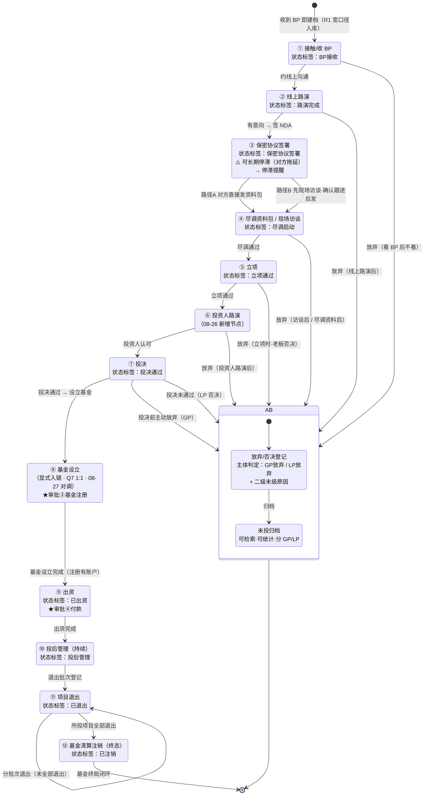
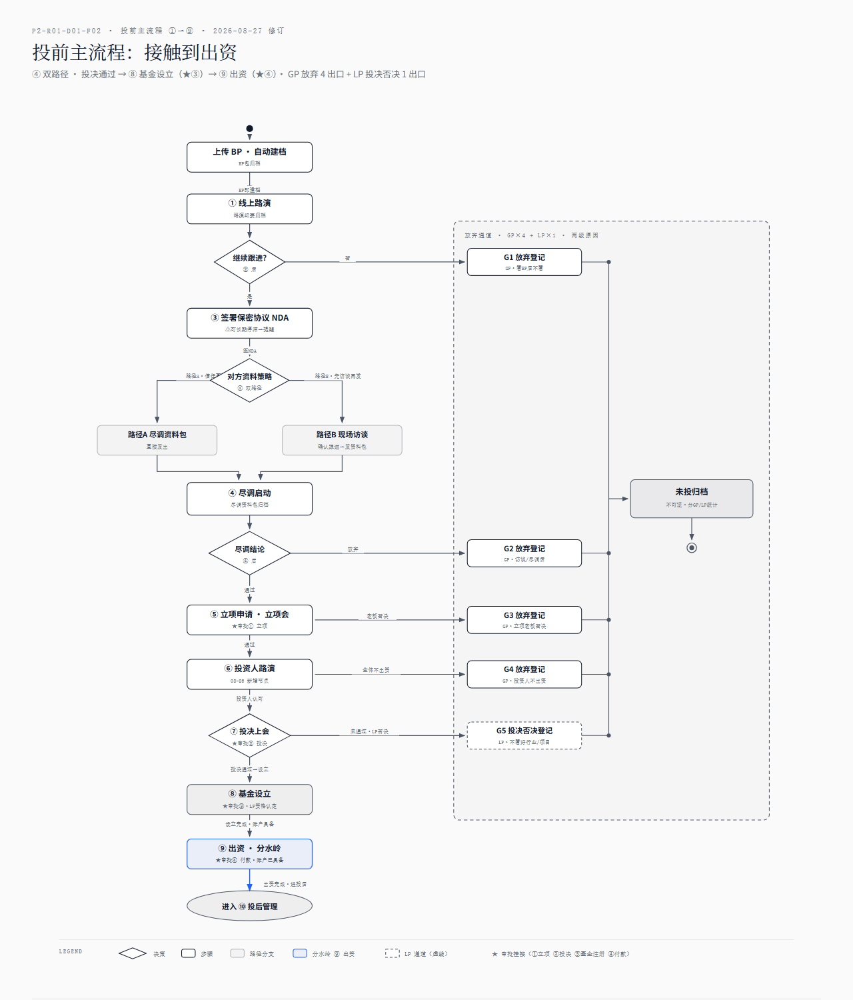
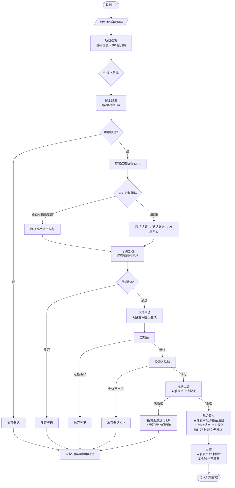
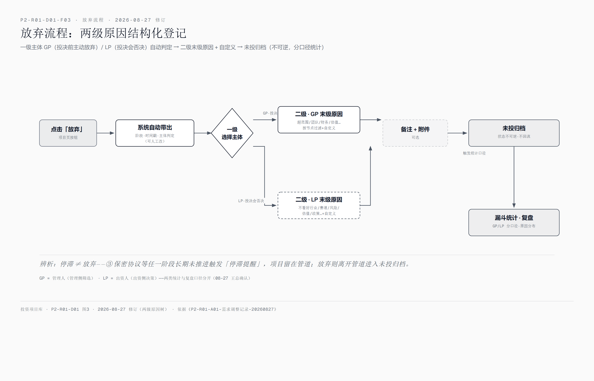
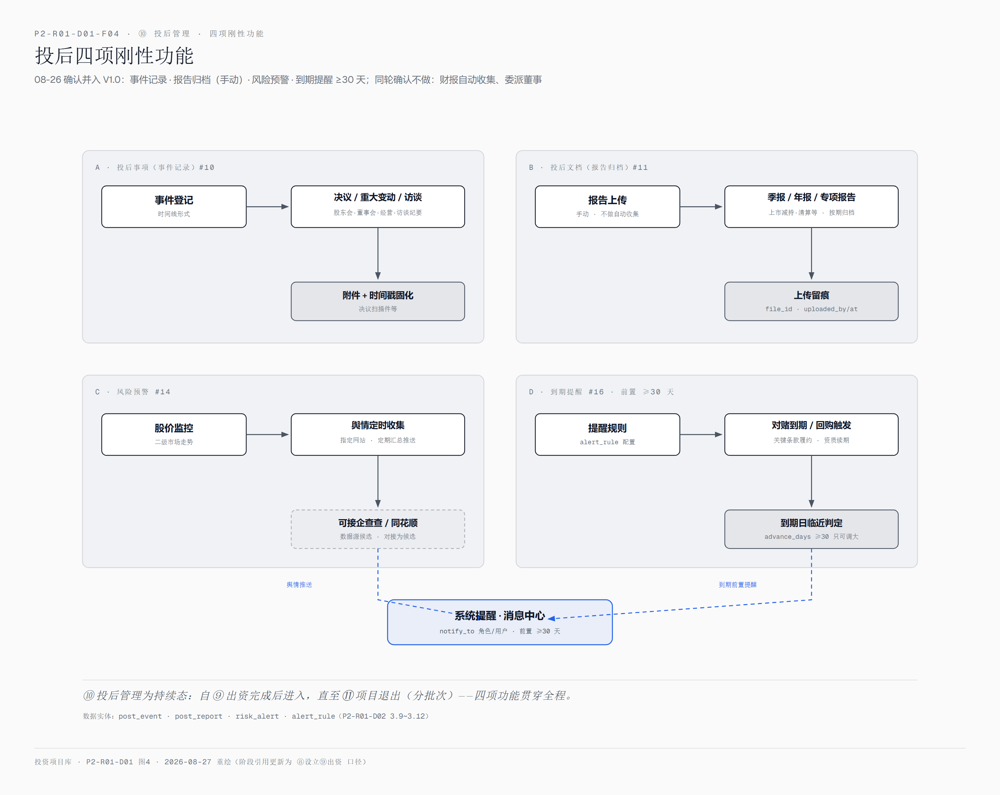
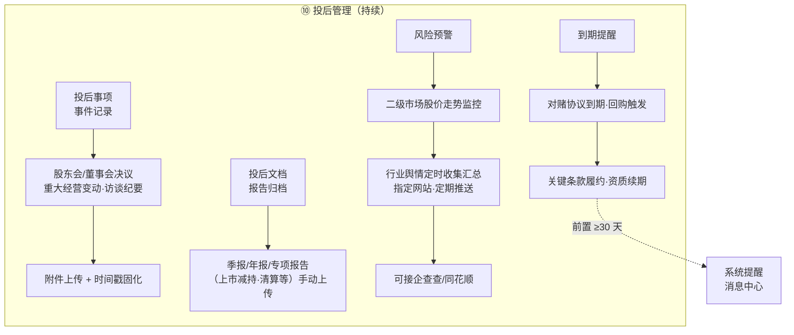
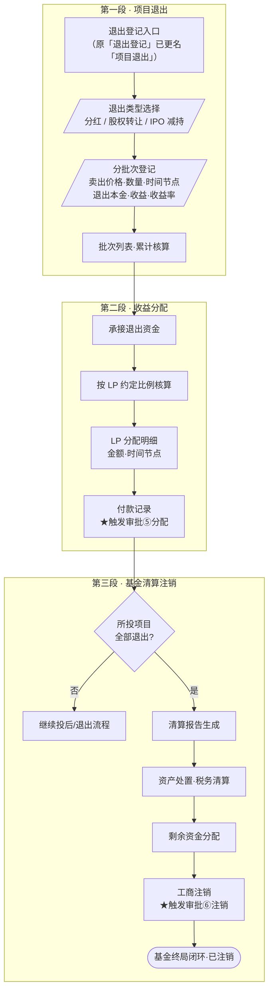
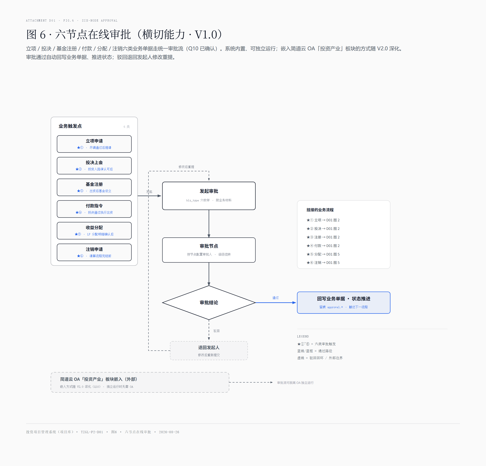
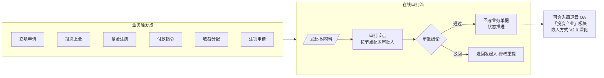

# 项目阶段流转与操作流程图

| 项 | 内容 |
|---|---|
| 文档编码 | **P2-R01-D01**（阶段·类型编码：项目 02 投资项目管理 · P2 功能调研 · D 设计文档 01） |
| 所属 | 《P2-R01-产品需求文档》设计文档 · 功能调研阶段（原型绘制前） |
| 建立日期 | 2026-08-26（依据P1-R01-A02 第五节沟通会结论 + 方案分析报告 V1.3 3.2/3.3/4.1）；**2026-08-27 修订**（《P2-R01-A01-需求调整记录-20260827》：⑧⑨对调、③停滞提醒、放弃 GP/LP 两级原因树）；**2026-09-04 修订**（P2-R01-A11 术语全项目统一：叶子原因→末级原因、投后时间线→投后事项；配图 F01/F03/F04/F05 的 HTML 已同步、PNG 重出） |
| 适用范围 | 投资项目库 V1.0（18 个功能点）开发设计输入 |
| 上游输入 | 十二阶段管道、7 个放弃节点、10 个标准状态标签、退出三段递进、投后四项刚性功能、六节点在线审批、基金 1:1 基准；08-27 调整：⑧基金设立→⑨出资（已确认对调）、阶段停滞提醒、GP/LP 两级原因树 |
| 下游消费 | P2-R01-D02-数据建模（实体与状态字段）、P2-R01-D03-功能菜单与字段清单（页面流转）、开发实现 |
| 图文双轨 | 每图提供 **PNG 图片**（美观，人眼阅读优先展示）与 **mermaid 源码**（底层信息，机器可读、跨工具传递；默认折叠，点击展开） |
| 术语说明 | 「阶段流转」= 项目所处阶段的推进与放弃规则（开发术语：状态机 State Machine）——面向业务方使用本文档时以「阶段流转」为准 |

## 一、项目全生命周期阶段流转

### 1.1 阶段流转全图（十二阶段 × 放弃分支 × 终态）

> 📎 图 1：全生命周期刚性固化——①~⑦ 投前管道 → ⑧⑨ 投资执行与设立（08-27 对调：先 ⑧ 基金设立、后 ⑨ 出资）→ ⑩~⑫ 投后与退出；● 标记 7 个可放弃节点（①②④⑤⑥⑦，③ 无放弃点但可长期停滞→触发停滞提醒）；⑫ 基金清算注销为终态焦点。高清原文件：[`P2-R01-D01-F01-十二阶段流转全图.html`](./P2-R01-D01-F01-十二阶段流转全图.html)（08-27 重绘版）

📐 mermaid 源码（底层信息，点击展开）

**流转规则**：

| # | 规则 | 说明 |
|---|---|---|
| 1 | 宽口径入库 | 无前置筛选，S1 即建档；BP 原件为首个入库材料（N1） |
| 2 | 每次流转留时间戳 | 状态迁移记录发生时间与操作人，形成项目时间线（N2） |
| 3 | 放弃节点 7 个 | 覆盖 ①②④⑤⑥⑦；**③ 保密协议环节无放弃点**（刚签 NDA 不会立即放弃）；放弃须附原因（N3） |
| 4 | 放弃不可逆 | 进入"未投归档"后不回流管道；如再接触按新项目建档（关联原档案） |
| 5 | ⑨ 出资为分水岭 | 08-27 对调：⑧ 基金设立（注册具备账户）→ ⑨ 出资打款；过 ⑨ 无"放弃"概念，后续仅正常流转至 ⑫ |
| 6 | ⑪ 分批次 | 一个项目可多次退出登记（分红/股权转让/IPO 减持各一批） |
| 7 | ⑫ 触发条件 | 该基金（1:1 基准下即该项目）所投项目**全部退出后**方可启动清算注销 |
| 8 | 阶段停滞提醒（08-27） | 任一阶段长期未推进（③ 保密协议为典型：对方同时对接多家资金方故意拖延）触发提醒与处置标注；**是停滞不是放弃**，项目仍留在管道 |
| 9 | 未投归档二分（08-27） | **GP放弃**=①~⑦ 投决前管理人主动放弃（管理侧筛选）；**LP放弃**=⑦ 投决会否决（出资人不认可行业/项目）；两级原因树分别挂末级原因，统计/复盘/责任判断分开 |

### 1.2 放弃原因两级分类（08-27 GP/LP 主体树 + 08-26 实例库）

一级 = 放弃主体（GP放弃 / LP放弃），二级 = 各主体独立的末级原因（预置 + 自定义）：

| 一级主体 | 触发范围 | 二级末级原因（初版，待业务补充） | 自定义 |
|---|---|---|---|
| **GP放弃**（管理人主动） | ①~⑦ 投决前任意放弃节点 | 按节点预置：① 明显超出投资范围；② 专业问题答不出/逻辑薄弱/团队能力不足；④ 访谈后-工厂萧条订单匮乏、尽调后-财务重大偏差疑似造假；⑤ 创始人信用风险/人品问题/债务纠纷；⑥ 全体投资人明确不出资；⑦ 投决前主动撤回（估值未谈拢、对赌条款不合理） | ✅ 各节点允许补充 |
| **LP放弃**（投决会否决） | ⑦ 投决未通过 | 不看好行业、不看好赛道、项目风险异议、估值异议、政策/合规顾虑（初版，待业务补充） | ✅ |

> GP = 管理人（管理侧筛选逻辑），LP = 出资人（出资侧决策逻辑）——两类放弃的业务含义不同，统计漏斗与复盘须分开口径（08-27 王总确认）。

## 二、操作流程图

### 2.1 投前主流程（①→⑨，含 ④ 双路径）

> 📎 图 2：接触到出资主链（08-27 对调：投决通过 → ⑧ 基金设立 → ⑨ 出资）。④ 双路径（A 直接资料包 / B 先现场访谈确认跟进后再发）；★①~★④ 为六节点审批挂接点（见图 6）；否定分支进入右侧放弃通道（GP）或投决否决通道（LP）。高清原文件：[`P2-R01-D01-F02-投前主流程.html`](./P2-R01-D01-F02-投前主流程.html)（08-27 重绘版）

📐 mermaid 源码（底层信息，点击展开）

### 2.2 放弃流程（任一放弃节点触发）

> 📎 图 3：未投闭环统一处理链——**两级原因结构化**（08-27：主体 GP/LP × 末级原因）为全市场空白，是漏斗统计与复盘的数据地基。高清原文件：[`P2-R01-D01-F03-放弃流程.html`](./P2-R01-D01-F03-放弃流程.html)（08-27 重绘版）

📐 mermaid 源码（底层信息，点击展开）

### 2.3 投后管理流程（⑩，四项刚性功能）

> 📎 图 4：08-26 确认的四项刚性功能（全部并入 V1.0）：事件记录、报告归档、风险预警、到期提醒。同轮确认不做：财报自动收集、委派董事。高清原文件：[`P2-R01-D01-F04-投后四项刚性功能.html`](./P2-R01-D01-F04-投后四项刚性功能.html)

📐 mermaid 源码（底层信息，点击展开）

### 2.4 退出三段递进（⑪→⑫，不可合并或省略）

> 📎 图 5：刚性三段——项目退出（分批次）→ 收益分配（LP 比例）→ 基金清算注销（全部退出后启动）；★⑤/★⑥ 审批挂接。高清原文件：[`P2-R01-D01-F05-退出三段递进.html`](./P2-R01-D01-F05-退出三段递进.html)

📐 mermaid 源码（底层信息，点击展开）

### 2.5 六节点在线审批流（横切能力 · V1.0）

> 📎 图 6：六类业务单据走统一审批流；系统内置可独立运行，嵌入简道云 OA 的方式随 V2.0 深化。高清原文件：[`P2-R01-D01-F06-六节点在线审批.html`](./P2-R01-D01-F06-六节点在线审批.html)

📐 mermaid 源码（底层信息，点击展开）

**审批节点与业务触点**：

| 节点 | 审批单类型 | 触发时机 | 关联流程 |
|---|---|---|---|
| ① 立项 | 立项申请单 | 尽调通过、提请立项会前 | 2.1 |
| ② 投决 | 投决上会单 | 投资人路演认可后 | 2.1 |
| ③ 基金注册 | 基金设立备案单 | 投决通过后启动基金设立（⑧，08-27 对调：先设立后出资） | 2.1 |
| ④ 付款 | 付款指令单 | 基金设立完成（账户具备）、执行出资（⑨） | 2.1 |
| ⑤ 分配 | 收益分配单 | LP 分配明细确认后 | 2.4 |
| ⑥ 注销 | 清算注销单 | 清算流程完结前 | 2.4 |

## 三、与功能点/数据模型的对应

| 流程 | 功能点（P1-R01-A04） | 数据实体（P2-R01-D02） |
|---|---|---|
| 阶段流转 | #3 管道、#4 时间戳、停滞提醒（08-27 新增，功能点 18） | project、stage_transition |
| 放弃流程 | #5 放弃节点、#6 原因结构化（08-27 升级两级：GP/LP × 叶子） | abandon_record、abandon_reason |
| 投前双路径 | #3 | stage_transition.path_type |
| 投后四项 | #10、#11、#14、#16 | post_event、post_report、alert_rule |
| 退出三段 | #18、#19、#17 | exit_batch、distribution、liquidation |
| 六节点审批 | #29 | approval |
| 基金/LP | #17、#20 | fund、lp_entity、lp_investment |

## 四、图文件清单

| 图 | PNG | HTML 高清原文件（F01~F04 已按 08-27 规则重绘；F05/F06 沿用 08-26 版，内容不受调整影响） |
|---|---|---|
| 图1 十二阶段流转全图 | `P2-R01-D01-F01-十二阶段流转全图.png` | `P2-R01-D01-F01-十二阶段流转全图.html` |
| 图2 投前主流程 | `P2-R01-D01-F02-投前主流程.png` | `P2-R01-D01-F02-投前主流程.html` |
| 图3 放弃流程 | `P2-R01-D01-F03-放弃流程.png` | `P2-R01-D01-F03-放弃流程.html` |
| 图4 投后四项 | `P2-R01-D01-F04-投后四项刚性功能.png` | `P2-R01-D01-F04-投后四项刚性功能.html` |
| 图5 退出三段递进 | `P2-R01-D01-F05-退出三段递进.png` | `P2-R01-D01-F05-退出三段递进.html` |
| 图6 六节点审批 | `P2-R01-D01-F06-六节点在线审批.png` | `P2-R01-D01-F06-六节点在线审批.html` |

## 五、关联文档

- 上游：《P1-R01-A02-原始需求记录》第五节、《P1-R01-方案分析报告》V1.3 第 3.2/3.3/4.1 节
- 下游：《P2-R01-D02-数据建模》《P2-R01-D03-功能菜单与字段清单》
